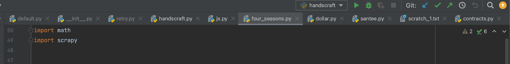
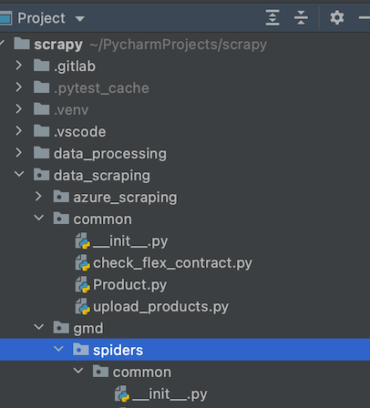
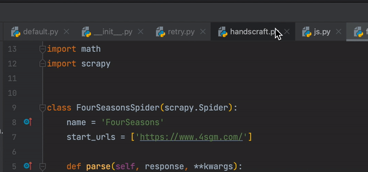
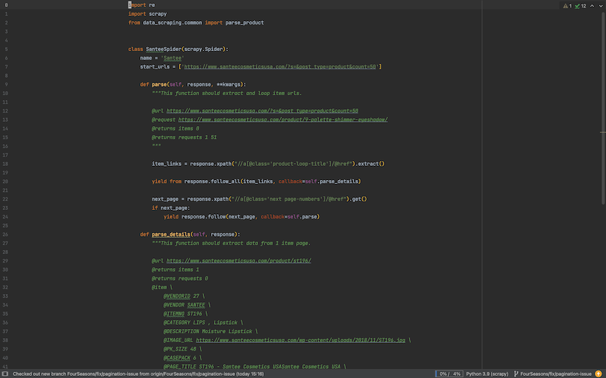
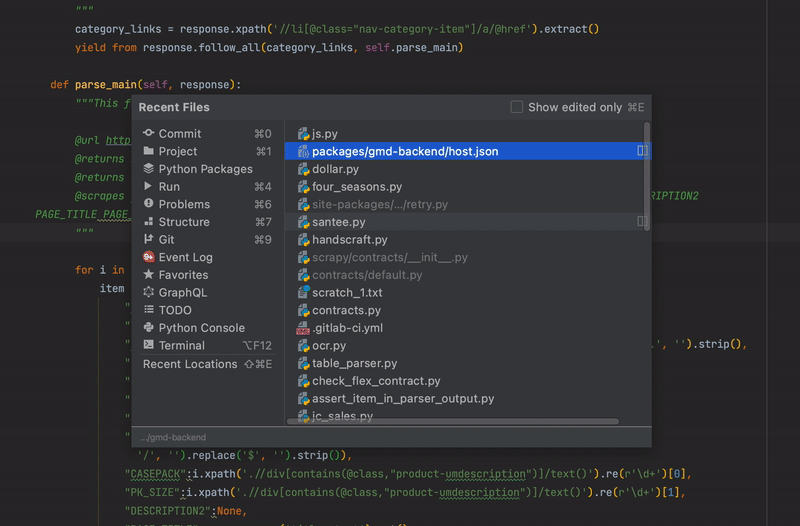
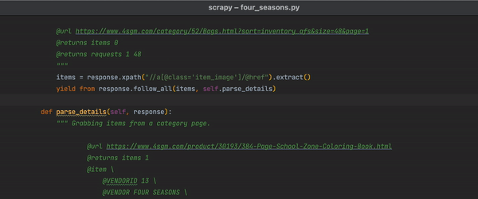
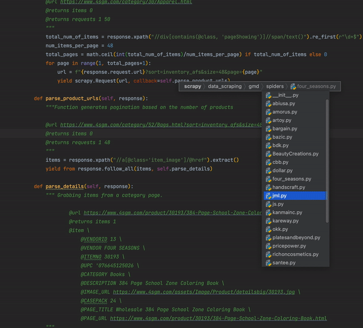
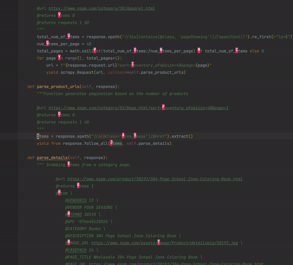

# Why should you read this

Our repository consists of many files of code. Many many files. And the amount will grow exponentially with time.
Keeping this fact in mind, all the devs should know how to efficiently navigate the code or will experience daily
frustration and slow development.

After reading this you will know how to code faster. The faster you code - the more code you produce. The more code you
produce - the better you get. The better you get - the more value you bring. The more value you bring - the more money
you earn.

This guide was written with PyCharm IDE, but will work in WebStorm too. VSCode may have similar features, but it is out
of scope.

# Three horsemen of slow navigation

By default most of devs navigate using Three horsemen of slow navigation:

- Tabs

- Tree view

- Mouse

We all know the pain of trying to find something: moving the mouse around, looking at tabs' names, clicking deeper and
deeper into the tree view, reading an endless amount of names.

**All forms of mouse navigation slow you down and cause frustration.**

If your project starts to consist of hundreds of files, then tabs/tree view/mouse will become your everyday pain.

# How to navigate efficiently in big projects

Check, how my working screen looks like. This is called "zen mode" in PyCharm and Webstorm:

- no tabs
- no tree view
- no distractions
- only pure code

How the hell you suppose to navigate using it?

## 1. Recent visited files view

I press a hotkey, that summons a list of recently visited files. If I start typing a file name, it will filter the list.
I can also move up/down in the list using other hotkeys. All with keyboard only, no mouse involved.

This alone is a game-changer. Now you can jump to a file by just thinking of it. Magic. This approach scales to super
big projects. You can also type names regard path like this:

- `backend package.json` This will allow you to jump to the file in a specific folder, even if it deep inside the tree.

There are also similar views, they function the same way, but search in different places:

- All project files view
- All project symbols view. Here you can jump by a function/class name
- Global search. Here you can search by text

The core idea is the same: you try to jump to a specific place using fuzzy text search.

## 2. Jump to the last file

I press a hotkey (tab in my case), and the active file switches to the prev file. I press the hotkey once again and
return back to the initial file. Extremely useful technique:

- this way you can use one file as a reference and work on another file

## 3. Jump to definition/use

You should have a hotkey to jump to the definition of function/variable/class under your cursor. This thing is used a
lot. You always want to check: what is inside this function?

## 4. Jump in history

You should have hotkeys to jump forward/backward in cursor history. This way you can always return back from your
current position. Regular scenario:

- you jump to a function definition
- you jump to subfunction definition
- your want to return back to the initial position
- here where history navigation shines

## 5. NavBar

I press a hotkey and activate a NavBar. This thing allows jumping to files, around the currently opened file. I can move
the cursor in the file tree relative to the curent file.

You can also start typing a filename and the filter will be applied.

# How to navigate efficiently in a file

This is an advanced section. You will need to install additional plugins into your IDE to use these features.

## 1. AceJump plugin

Imagine you need to make a change in a file in a specific location, but your cursor is not in the location. No big deal.
Usually you:

- remove your arm from the keyboard
- take your mouse
- move the cursor to the new position and click
- put your arm back on the keyboard
- type

It is expensive to use the mouse, it breaks your coding flow. There is a better way. I introduce to you a plugin
AceJump, 500k downloads.

- I press a hotkey (in my case space)
- Type the first letter of the word I want to jump to
- Then AceJump highlights several different points on screen I can jump to
- I select the point I want to jump
- Done. Magic. All using only keyboard

## 2. IdeaVim plugin. Become a coding Demigod

The king of text navigation and editing [Vim](https://en.wikipedia.org/wiki/Vim_(text_editor)) available as a plugin in
all major IDEs. In PyCharm it has **10 million downloads**, truly the king. It makes your code editing really fast but
has a really stiff learning curve. Expect to get good at vim in a month.

The core idea: all your keys are hotkeys, if you press them - you don't type, but perform some text-editing action. You
need to actually enter "editing mode" only then you can type text. This allows vim to have a lot of hotkeys, and I mean
really a lot. Examples:

- If I press `j` I will go a line down. The same way as you press the down arrow, but this key located in a convenient
  spot.
- If I press `h` I will go left
- `w` and I will go to the end of the current word under the cursor
- If I type `dw` I will delete the current word under the cursor
- If I type `dd` I will delete the current line
- `}` I will jump to the next error in this file
- `[` I will jump to prev location in history
- `fd` I will jump to the definition of function/class/etc under the cursor
- `fu` I will jump to use of function/class/etc under the cursor
- `alt+]` I will find and jump to the next same word under my cursor
- If I type `fr` I will open "1. Recent visited files view"
- `di'` I will delete all the text inside ' quotes
- `p` will insert the deleted text
- `cs'"` will change surrounding quotes from ' to "

As you can see commands becomes complex and have micro language going on. You can delete/insert/move around/type pretty
complex stuff. With time you will think with vim and text editing becomes lightning fast.

I recommend searching youtube tutorials to get started with vim.

Aleksey and Guilherme recorded
a [Video Onboarding Session on Ideavim](https://drive.google.com/file/d/1WhsXspI-h3Q0KRybjiskUYUK3hgv34Wb/view?usp=sharing)
, check it out to know how to use vim in Webstorm.

### .vimrc

Vim assumes, that you will add your custom hotkeys. This way you can automate your day-to-day typing work. All custom
key configuration goes to `.vimrc` file or `.ideavimrc`. Here you can
check [my custom key configuration](https://gitlab.com/engaging/scrapy/-/snippets/2120084) for PyCharm and Webstorm. I
use it day-to-day, it's a good place to start.

---
---

### :bulb: Help us to improve the Wiki
- Didn't find something?
- Explanations were not clear?

[Leave a feedback!](https://docs.google.com/forms/d/e/1FAIpQLScE_i7txZOlPgFhmnBOephz9hdhvnJDbXjmkKqnjRSjx_d8kg/viewform?usp=pp_url&entry.685765712=Code-Navigation-Guide.md)

---

[What is your favorite hobby or a computer game?](https://forms.gle/X4U9Jni6s3hfSW8e6) Answer, and find out the 
answers of others! 

---

*Let's automate the world :earth_asia:*
