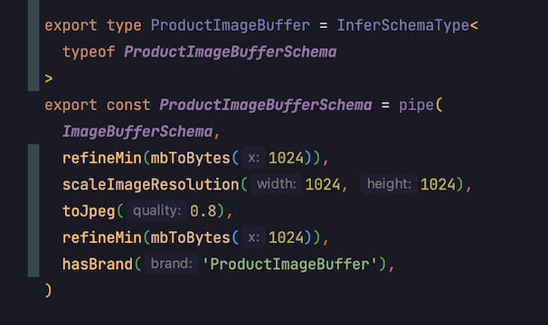

Why "Top -> Down" design approach is superior for developing.

## When design a protocol, think of the protocol user

When you design a protocol of any sort:

- function
- api
- module
- class
- type
- react component
- etc

You often encounter tradeoffs:

- make the protocol easier to use, but harder to implement
- make protocol easier to implement, but harder to use

Always pick "easier to use". When you design your system of easy to use components, your life becomes sweet as honey. It
is easy to change implementation, but expensive to change protocol.

Imagine you design a button React component. You give a protocol user maximum freedom, however, you doom the user to
spend limited cognitive resources to decide all the details:

```
<UIButton 
  size={17} 
  color={'red'} 
  margin={10} 
  padding={10}
  font={'Arial'}
  onClick={fire}>
  Fire!
</UIButton>
```

If you have 100 of these buttons in your huge app, then in each button a developer will spend his time configuring the
thing. Also, the button styles will be out of sync, this will make the app harder to use. And when you will want to
change the app style, you will need fix it in 100 places.

Now check this button:

```
<UICallToActionButton onClick={fire}>Fire!</UICallToActionButton> 
```

This button is extremely easy to use and change. And all buttons in your app with the similar function will look the
same.

To design a protocol to be easy to use, you need to use "Top -> Down" approach.

## Prefer "Top -> Down" design approach

Imagine you need to design a ProductImageBufferSchema. This schema should:

- scale images to max size
- convert images to jpeg
- check that input/output images are not greater than some limit

There are 2 different meta design approaches that a developer could take:

- Bottom -> Up. First you design implementation, eg, you make functions for scaling and image conversion. Only then you
  compose them into the final product
- Top -> Down. First you design the final schema, use mock functions. Only when you are happy with the design you start
  to implement details

Top -> Down should be your preferable approach. In our business, it is harder to fit pieces together, rather than
implement a piece:

- You will always be able to implement some abstraction. They may be not as efficient, but in serverless we can just
  throw money and get more performance, eg, computations are cheap
- But if you chose bad abstractions, they will be hard to connect. Harder to connect – exponentially more dev time – dev
  time is expensive. And it is expensive to change a protocol, so you will stuck with the bad abstractions

Here we designed the pieces first, and then connected them together:

```typescript
export const ProductImageBufferSchema = pipe(
  ImageBufferSchema,
  refineAsync(isLessThanAllowedSize, `image size is larger than the allowed size (${MAX_ACCEPTED_SIZE_MB})`),
  scaleImageBuffer,
  toJpeg,
  refineAsync(isValid, 'Image size too big'),
  hasBrand('ProductImageBuffer')
)
```

And here we made the final design first, and then implemented the pieces:



Here we thought of how our schema params could be configured on the top level, and how functions would fit together.

## Conclusion

- Design things that way, that they will be easy to use. This approach scales
- Prefer Top -> Down design approach. Think of high level abstractions first, then decompose them, and only then, when
  all parts fit together perfectly, think of the implementation

---
---

### :bulb: Help us to improve the Wiki
- Didn't find something?
- Explanations were not clear?

[Leave a feedback!](https://docs.google.com/forms/d/e/1FAIpQLScE_i7txZOlPgFhmnBOephz9hdhvnJDbXjmkKqnjRSjx_d8kg/viewform?usp=pp_url&entry.685765712=Design-things-that-way-that-they-will-be-easy-to-use.md)

---

[What is your favorite hobby or a computer game?](https://forms.gle/X4U9Jni6s3hfSW8e6) Answer, and find out the 
answers of others! 

---

*Let's automate the world :earth_asia:*
