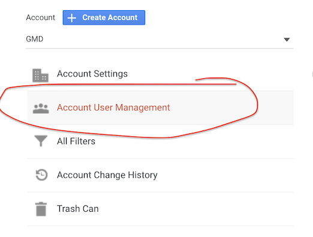

Imagine you have a barcode scanner app, and you want to know:

- how many users are using the app daily?
- how many barcodes scanned by all users combined?
- how many barcodes scanned was actually found in our database?
- how many was not found?
- etc

As you can see there are a lot of questions you want to ask, but how you get all the answers? To get the answers you
must collect data. For example: events of users scanning barcodes, or a user logged into your application. This data
collection is a hassle to set up manually, eg, to write custom code for collection the data and building reports. The
reports can get quite complex, you do not want to waste your time coding them.

This is why we are using Google Analytics 4 – a handy tool for user events collection and report building.

## Get your access to GA4 reports

You will need a gmail. A GA4 admin should be able to grant you access in the "Admin" panel of GA4. Just click "Account
User Management" and add the gmail:

## Programmatically send GA4 events

`useAnalytics()` hook should give you access to analytics events from any part of UI. This is achieved with React
Context API. `<AnalyticsGoogleProvider />` creates the context, you can find it in the root of your app.

### trackingCode

`<AnalyticsGoogleProvider />` needs `trackingCode` to function. This is a special string, you can get it in the "
Property" tab of GA4 admin panel. `trackingCode` tells the analytics where to send events. Staging and Production apps
have different `trackingCode`, so events from staging would not pollute production.

`trackingCode` is being configured with `NEXT_PUBLIC_GOOGLE_TRACKING_CODE` environment variable.

---
---

### :bulb: Help us to improve the Wiki
- Didn't find something?
- Explanations were not clear?

[Leave a feedback!](https://docs.google.com/forms/d/e/1FAIpQLScE_i7txZOlPgFhmnBOephz9hdhvnJDbXjmkKqnjRSjx_d8kg/viewform?usp=pp_url&entry.685765712=Google-Analytics.md)

---

[What is your favorite hobby or a computer game?](https://forms.gle/X4U9Jni6s3hfSW8e6) Answer, and find out the 
answers of others! 

---

*Let's automate the world :earth_asia:*
