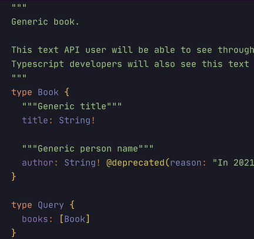

GraphQL has many advantages over REST:

- There is a single source of truth: GraphQL schema file. It contains the whole protocol description and documentation.
  It also allows marking fields for depreciation. Using the schema file front and back teams can independently and
  parallel work on the system.
- The schema file could be compiled into TypeScript types thus you will be sure that developers will not be able to make
  a commit that breaks protocol.
- The schema file could be compiled into React Apollo Hooks/React Query Hooks, thus you will avoid writing boilerplate
  on the mobile frontend.
- API clients can decide on the shape of the requested data. Even a component on a screen can decide the shape. That
  speeds up client development + saves traffic/response time. Protocol becomes more flexible.

Compare with REST:

- You need to make several requests or excessive requests to fetch data
- You need to have multiple endpoints
- Boilerplate code. You will need to manually update TypeScript types and TypeScript API code that uses REST on each API
  breaking update.
- You need to run integration tests between front and back, because they can end up breaking protocol, eg you updated
  back but forgot to update front
- You need to manually keep API documentation in sync with actual code. This is a prominent pain point.

## App development is exploratory

Usually, you start building one app; start getting feedback from users; start to change your app; and ended up with a
different app. App development is a process of discovering and fulfilling users' needs. It's a dynamic mutation process.
GraphQL helps facilitate this mentality:

- It has consistent documentation
- It allows clients to decide on the shape of the API
- It allows mutating a schema without breaking it

## Cool GraphQL features screenshots

- GraphQL schema file is a single source of truth for an API, it's the heart of an API. It consists of type definitions,
  API documentation, and deprecation directives.

- A schema file could be compiled into TypeScript types and React hooks. That ensures that the server and client will
  never break protocol without notice. Your CI/CD pipeline will detect every break and will not allow it into
  production. It also saves lots of boilerplate code.
- API documentation and depreciation directives also compile to TypeScript. Developers get all documentation as hints in
  their IDE.

- Schema also available through introspection: aka you can have access to all types and documentation via GraphQL
  playground. Developers love this feature: they can play with API and have access to the documentation in their browser
  for free.

## Breaking changes

Frontend and backend developers should agree on the schema before starting the development process. Moreover, every
schema update should be discussed between teams.

Remember:

* adding stuff into a schema doesn't break protocol and is cheap
* however, removing/renaming stuff from the schema breaks protocol and should be done via deprecation lifecycle

The schema should be broken as less frequently as possible. Thus designing a schema one should not rely on back/front
implementation details.

## Generate TypeScript from GraphQL schema

[Never write TypeScript types for GraphQL schema by hand](https://alekseykozin.medium.com/never-write-typescript-types-for-graphql-schema-by-hand-4c35fe302845)
.

## GraphQL is a competitive advantage

When a company specializes in developing cross-platform distributed cloud systems GraphQL becomes a major competitive
advantage. Teams that utilize GraphQL can move faster than REST teams.

## What's next

- [Guidelines On Designing GraphQL Schema](Guidelines-On-Designing-GraphQL-Schema.md)

---
---

### :bulb: Help us to improve the Wiki
- Didn't find something?
- Explanations were not clear?

[Leave a feedback!](https://docs.google.com/forms/d/e/1FAIpQLScE_i7txZOlPgFhmnBOephz9hdhvnJDbXjmkKqnjRSjx_d8kg/viewform?usp=pp_url&entry.685765712=GraphQL-vs-REST.md)

---

[What is your favorite hobby or a computer game?](https://forms.gle/X4U9Jni6s3hfSW8e6) Answer, and find out the 
answers of others! 

---

*Let's automate the world :earth_asia:*
