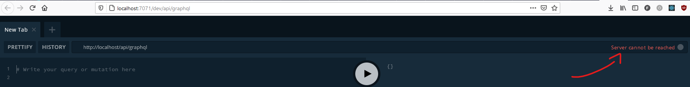
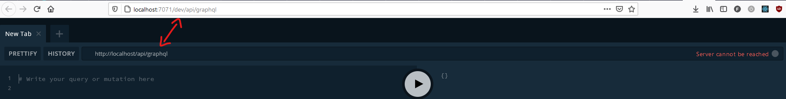

We assume you:

- Have Node 10 installed (We use v10.24.0, you can use other node versions, but if you encounter any issues, we
  recommend that you switch back to v10)
- Have Yarn and NPM installed
- Know Git
- You read [How to Work With TypeScript Projects](wiki/How-to-Work-With-TypeScript-Projects.md)
- You successfully installed the repo (ie by running `yarn test` all the tests pass)

#### 1. Installing Azure Functions

Azure Functions Core Tools lets us develop and test azure functions locally, we use them to connect to live azure
services, debug functions...

We recommend that you
install [v3](https://docs.microsoft.com/en-us/azure/azure-functions/functions-run-local?tabs=windows%2Ccsharp%2Cbash#v2)
of azure functions, you can find the functions runtime versions and function tools
version [here](https://docs.microsoft.com/en-us/azure/azure-functions/functions-versions) if you want to read some docs

#### 2. Local Settings File

The `local.settings.json` file stores app settings, connection strings, and settings used by local development
tools [more here](https://docs.microsoft.com/en-us/azure/azure-functions/functions-run-local?tabs=windows%2Ccsharp%2Cbash#local-settings-file)

We use MSSQL as an RDBMS, that's what we will configure in our `local.settings.json` file

accessing the database is not allowed publicly even if you have the correct credentials, you can't connect to it unless
you're allowed to (ie your IP address is in Azure's firewall)

If your IP is not in Azure's firewall, you'll see a `ConnectionError` message in your console:

```
Can't connect to MSSQL: ConnectionError: Cannot open server 'gm
d-test-server' requested by the login. Client with IP address 'xx.xxx.xx.xxx' is not allow
ed to access the server.  To enable access, use the Windows Azure Management Portal or run
 sp_set_firewall_rule on the master database to create a firewall rule for this IP address
 or address range.  It may take up to five minutes for this change to take effect.
```

you need to get the DB credentials, and add your IP address into azure whitelist, contact our git repo managers on
slack. (If your IP is dynamic, make sure to mention that to your contact).

Assuming you have the credentials, and your IP is whitelisted, you can now config your config file

1. Create `local.settings.json` file in the directory `data_processing/packages/gmd-backend/local.settings.json`
2. Use the following template, change credentials as needed

```json
{
  "IsEncrypted": false,
  "Values": {
    "FUNCTIONS_WORKER_RUNTIME": "node",
    "AzureWebJobsStorage": "",
    "SQL_SERVER": "gmd-test-server.database.windows.net",
    "SQL_PORT": "1433",
    "SQL_DATABASE": "IProcessor_test",
    "SQL_USERNAME": "your-username",
    "SQL_PASSWORD": "your-password",
    "BLOB_HOST": "gmdstaging.azureedge.net",
    "APP_HOST": "gmdstagingapp.azurewebsites.net"
  }
}
```

#### 3. Starting the Backend

There are two ways to start the backend, one is a shortcut for the other

1. From `gmd` module:
   If we
   check [data_processing/packages/gmd/package.json](https://gitlab.com/engaging/scrapy/-/blob/dev/data_processing/packages/gmd/package.json)
   we'll see that there are different scripts that we can use
    - `dev` starts both the backend, and the frontend in parallel
    - `dev:backend` starts the backend
    - `dev:frontend` starts the frontend Since we only want to start the backend, we'll use `yarn dev:backend`

2. From `gmd-backend`: run `yarn run start:dev`,
   check [data_processing/packages/gmd-backend/package.json](https://gitlab.com/engaging/scrapy/-/blob/dev/data_processing/packages/gmd-backend/package.json)
   for more scripts

##### Making sure that the backend is started correctly

You should see a log of the functions available:

```bash
Functions:
    graphql: [GET,POST] http://localhost:7071/api/graphql
    system: [GET,POST] http://localhost:7071/api/system
    LocalAzureFunctionsAPI: [GET,POST,HEAD,PUT,DELETE,OPTIONS,PATCH,TRACE] http://localhost:7071/dev/api/graphql
    LocalStaticfrontendonAzureStorage: [GET,POST,HEAD,PUT,DELETE,OPTIONS,PATCH,TRACE] http://localhost:7071/dev/{*restOfPath}
    AzureFunctionsAPI: [GET,POST,HEAD,PUT,DELETE,OPTIONS,PATCH,TRACE] http://localhost:7071/api/{*restOfPath}
    StaticfrontendonAzureStorage: [GET,POST,HEAD,PUT,DELETE,OPTIONS,PATCH,TRACE] http://localhost:7071/{*restOfPath}
```

If you go to [http://localhost:7071/dev/api/graphql](http://localhost:7071/dev/api/graphql) you'll see the graphql
playground dashboard



That's because the link of graphql in the graphql playground is wrong



Updating graphql's link to `http://localhost:7071/dev/api/graphql` fixes the problem

## What's next

- [How to Test Time Trigger Functions](How-to-test-time-trigger-functions.md)

---
---

### :bulb: Help us to improve the Wiki
- Didn't find something?
- Explanations were not clear?

[Leave a feedback!](https://docs.google.com/forms/d/e/1FAIpQLScE_i7txZOlPgFhmnBOephz9hdhvnJDbXjmkKqnjRSjx_d8kg/viewform?usp=pp_url&entry.685765712=How-To-Run-Backend-Locally.md)

---

[What is your favorite hobby or a computer game?](https://forms.gle/X4U9Jni6s3hfSW8e6) Answer, and find out the 
answers of others! 

---

*Let's automate the world :earth_asia:*
