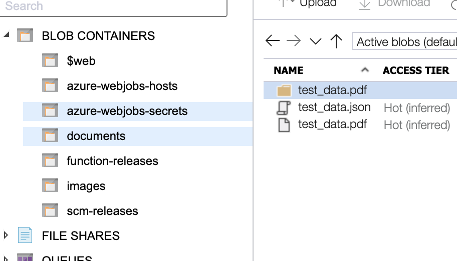
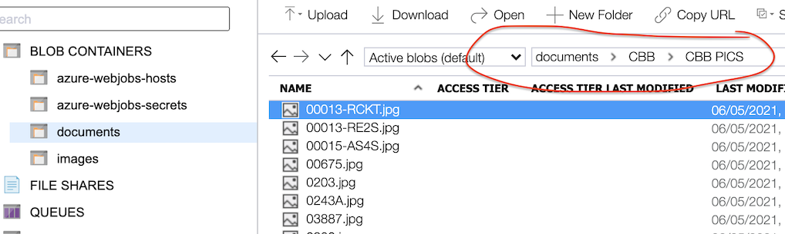
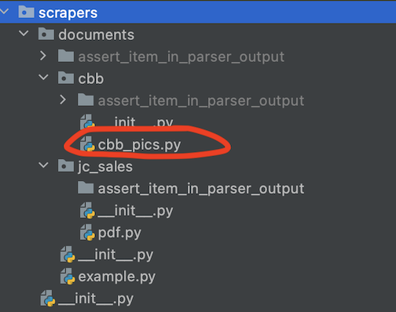
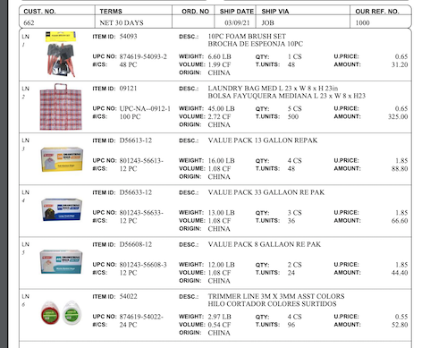
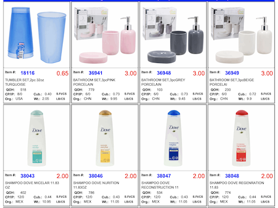
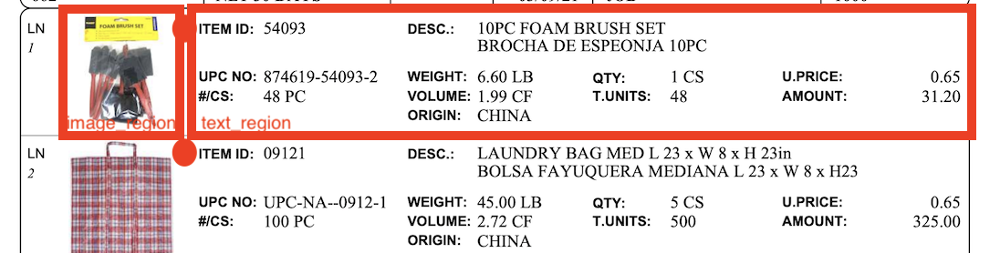

We have a lot of PDFs in the Azure cloud. These PDFs contain product listings. All these PDFs have different formats:

- each vendor has a custom PDF format
- moreover, each vendor can have several PDF formats

In order to extract products from these PDFs we need to perform:

- Optical Character Recognition, to extract text related to a product
- Image crop. To extract images related to a product

We grab this image and product data and store it in the Azure cloud.

# Requirements

- To run PDF tests locally, you will need to install [pdf2image](https://pypi.org/project/pdf2image/). It uses `poppler`
  , a tool that can convert PDF to image, and this tool should be installed separately. Please, follow
  this [guide](https://pypi.org/project/pdf2image/) to install poppler
- You should read and follow [Scalable Software Development Guide](Scalable-Software-Development-Guide.md)
- Install zbar locally. You can install it running:

```shell
# Linux
sudo apt install libzbar0;
# MacOS
brew install zbar
```

# Video Onboarding

!!!

Check this video of
how [Aleksey and Saleem are making a PDF parser](https://drive.google.com/file/d/1_YX4n8XrFKpK8AH3FCRebh8CQU7jw9Bo/view?usp=sharing)
If the video quality is low in your browser, download a file and play it locally. You will learn:

- how to make pdf parser
- hot to debug them
- what are typical issues, and how to investigate them

Also,
check [One cool trick on how to adjust text region in parsers](https://drive.google.com/file/d/1v0uIPvrGYDHcExd1JOm4aBMoV_Tu6Llo/view?usp=sharing)

!!!

# How to make Document Scrapers

### 1. Find a document format to scrape

You can find tasks in [Agile Workflow](Agile-Workflow.md), it should refer to a Kanban Board

### 2. Create a new branch

- Read and follow [Branch Name Convention](Branch-Name-Convention.md)
- Read and follow [Conventional Commits](https://www.conventionalcommits.org/en/v1.0.0/)
- Create a new branch from `dev` branch. `dev` - is our default branch. We should aim to merge things into it

### 3. Start Merge Request to `dev`

All communication and work on scrapers happen in
a [merge request](https://docs.gitlab.com/ee/user/project/merge_requests/creating_merge_requests.html). The request
should use `Document Scraper Merge Request` template. You can choose the template during the Merge Request creation.
Then follow the instructions in `Document Scraper Merge Request`.

### 3. Code the Document Scraper!

Here comes the fun part. Read [How to Develop Document Scrapers](How-to-Develop-Document-Scrapers.md) guide.

# What data do we need to collect

- ItemNumber - unique id of an item inside the vendor
- UPC - a number that will be incode into a barcode, so scanners could find the item. In theory unique if of the item
  Globally in the world, but often it is not the case. We can have 2 different items with the same UPC
- Image - The item's image
- Descriptions - The item's description

You will find, that sometimes we collect more data in different spiders/parsers, like, cost or category. We do not need
it at the current state, skip all additional fields.

Sometimes we can collect image, but can't collect UPC. Or we can collect UPC but could not find an image. We want to
grab the partial data in this case. It is ok to have a UPC without an image and vice versa

# System overview

Currently, the system is being deployed from 'dev' branch into the staging environment.

- We have an [app](https://gmdstagingapp.azurewebsites.net/products/) in the cloud. If you scan a UPC, for example, "
  87461954022", you will get parsed data on the screen. The app consists of React Frontend, and GraphQL backend. You can
  find them in `data_processing` repo subfolder. The app consumes data from the Ultimate table.
- We have Scrapy Spiders. They parse websites and send products to Web Scraping API.
- We have `azure_scraping` Azure Function App. This app performs OCR on Azure blob container and extracts products from
  PDFs. And sends products to Web Scraping API. In this document, we will focus on `azure_scraping` Azure Function App

# `azure_scraping` Azure Function App

The app can be found in `data_scraping/azure_scraping`. This app currently has 2 main functions:

- function_ocr. This function performs OCR and stores results in the cloud.
- function_ocr_product_parser. This function uses the PDFs/Images and OCR data and extracts products from them.

These functions are Python functions, that being executed on "blobTrigger".

# How `azure_scraping` works

Azure Blob Storage is like a huge folder in a cloud. It can contain inside lots and lots of data. This data is key/value
data. Where key is text and data is anything. Key usually represents some sort of a path 'some/sort/of/a/path.pdf'. So
we can group related data in "folders". It is O(1) to find data by key in the blob storage. Sort data is O(n*log n),
search is O(n), and n is a very big number.

---

---

When you add data to the blob storage or update the data, it generates Events. You can attach functions to these Events,
called "blobTrigger". The idea here is simple:

- someone puts a PDF in blob storage named 'vendor/attachement.pdf'
- this triggers the `function_ocr` that performs text recognition and puts results into '
  vendor/attachement.pdf/ocr.json'
- this triggers the `function_ocr_product_parser` that extracts products from the PDF and OCR data

# How `function_ocr_product_parser` works

function_ocr_product_parser.py/main() is a entry point of the function. It triggers on `ocr.json` file added into the
blob storage. Its the main goal is:

- call `find_parser(base_module, url)` that will find a corresponding parser for the PDF
- call `parser(pages, url)` that will extract products and images from pages
- call `store_products_service(products)` to send the results to Web Scraping API

`find_parser(base_module, url)` works that way. We have blob structure like this:

- `https://gmdstoragestaging.blob.core.windows.net/documents/Some Vendor/pdf/test_data1.pdf`
- `https://gmdstoragestaging.blob.core.windows.net/documents/Some Vendor/pdf/test_data2.pdf`
- `https://gmdstoragestaging.blob.core.windows.net/documents/Some Vendor/image/img.jpg`
- `https://gmdstoragestaging.blob.core.windows.net/documents/Some Vendor/image/img2.jpg`
- `https://gmdstoragestaging.blob.core.windows.net/documents/Some Vendor/image/img3.jpg`

This structure repeats itself in our repo:

- `/data_scraping/azure_scraping/function_ocr_product_parser/scrapers/documents/some_vendor/pdf.py`
- `/data_scraping/azure_scraping/function_ocr_product_parser/scrapers/documents/some_vendor/image.py`

`find_parser(base_module, url)` takes base module `data_scraping.azure_scraping.function_ocr_product_parser.scrapers`
and tries find a corresponding parser in it.

This way you can put new PDF Scrapers into `function_ocr_product_parser/scrapers` folder and they will be automatically
connected to our system.

- Azure



- Git



# How to make PDF Scrapers

- You will need a PDF URL, that you want to parse. Get this URL from the management
- Copy one PDF Scraper that you like and put it into `function_ocr_product_parser/scrapers`. Name it as the vendor
  folder in the Azure blob storage.
- Now form doctest for your scraper using `assert_item_in_parser_output()`. This test will validate, that your scraper
  works fine on the real pdf data.

```python
def main(pages, url):
    """[(page_image, page_ocr), ...] -> [(product_image, product), ...]

    >>> assert_item_in_parser_output(
    ... parser=main,
    ... url='https://gmdstoragestaging.blob.core.windows.net/documents/example/test_data.pdf',
    ... VENDORID=1,
    ... VENDOR='example',
    ... ITEMNO='54093',
    ... COST=0.65,
    ... UPC='874619540932',
    ... DESCRIPTION='10PC FOAM BRUSH SET BROCHA DE ESPEONJA 10PC',
    ... )
    """
    ...
```

`assert_item_in_parser_output()` will check, that your parser works as expected, without a need to run it in the cloud.
It needs:

- `parser` which is the main function
- `url` is a link to PDF you want to parse
- `**kwargs` which are your expectations, of what data you want to find in the document.

Having this doctest you can "shift+enter" in your IDE to run your PDF parser and validate, that it works fine.

## Parser Main() function

Now you need to write the main function.

### Main() arguments

This function should receive `pages`. Pages are a list of a shape [page, page, page, ...]. where `page` has shape
of [image, ocr], where:

- image is a PIL image of a pdf you parse. You can save it on your drive with `image.save('path.jpg', format='JPEG')`
- ocr is a list [box, box, box, ...], where box is ['text', top, left, width, height]. Box describes a 1-word position
  in the PIL image. Coordinates units is % of image width or heights.

For example a box ['hello', 0.5, 0.5, 0.01, 0.01] tells us, that there is a word 'hello' in the center of the PIL page
image. And this word has width=(1% of image width), and height=(1% of image height)

### Main() return value

The main function should return a list of products, where a product is a combination of (image, product_data). Image -
is a PIL image of the product, and product_data is a dict(). The product_data dict() will be parser with `Product` shape
from `data_scraping/common/Product.py`.

### marker_parser()

PDFs from different vendors are different, however that have a common theme:




They have in common:

- listings of images, and there is text near each image
- these images laid out in a regular pattern

Cuz this theme repeats from vendor to vendor we can extract its logic in a function. This way it will be easy to write
our main() function. Consider this:

```python
def main(pages):
    return marker_parser(
        pages,
        find_markers=find_markers,
        image_region=(-0.14, -0.009, 0.13, 0.091),  # (left, top, width, height) in percent relative to the marker
        text_region=(-0.001, -0.01, 0.726, 0.089),
        extract_product_from_text=extract_product_from_text,
    )
```

We introduced the `marker_parser()` function which will be common for PDFs with such a layout. The core idea of
marker_parser:

- find a marker for each product on a page. Each product has only 1 marker point. This point should be in the same place
  for each product. Example of markers:


As you can see each product has "ITEM" text. So, we can treat each "ITEM" position as a marker for each product.

```python
def find_markers(ocr):
    """For each product on an image this function returns unique (x, y), eg, a marker point
    >>> find_markers([
    ... ('hello', 1, 1, 1, 1),
    ... ('ITEM', 12, 1, 13, 1),
    ... ('ITEM', 12, 1, 13, 1),
    ... ('item', 1, 1, 1, 1),
    ... ])
    [(12, 1), (12, 1)]
    """

    return [
        (left, top)
        for text, left, top, width, height in ocr
        if re.match(r'(ITEM)', text)
    ]
```

- for each product, relative for its marker, we can extract product Image and Text with image_region and text_region.
  Regions have format [top, left, width, height] and the units are % of page width and height. Here is an example of
  image_region and text_region relative to the first marker:



- using image_region we can extract and store the image
- using text_region we can extract text from OCR data, however, this is not enoght. We need further extract UPC, Price,
  ItemNumber, etc from this text. The extracted text looks like this:

```
ITEM ID: 54093 DESC.: 10PC FOAM BRUSH SET
BROCHA DE ESPEONJA 10PC
UPC NO: 874619-54093-2 WEIGHT: 6.60 LB QTY: 1CS U.PRICE: 0.65
#ICS: 48 PC VOLUME: 1.99 CF T.UNITS: 48 AMOUNT: 31.20
ORIGIN: CHINA
```

Here we can use regular expressions to extract corresponding data. `extract_product_from_text()` function does exactly
that:

```python
def extract_product_from_text(text):
    """Recives OCR text, extracts product. Text could contain garbage or wrong reads.

    >>> extract_product_from_text('''
    ...   d   J
    ... ITEM ID: 54093 DESC.: 10PC FOAM BRUSH SET
    ... BROCHA DE ESPEONJA 10PC
    ... UPC NO: 874619-54093-2 WEIGHT: 6.60 LB QTY: 1CS U.PRICE: 0.65
    ... #ICS: 48 PC VOLUME: 1.99 CF T.UNITS: 48 AMOUNT: 31.20
    ... ORIGIN: CHINA
    ... fd
    ... ''')
    {'VENDORID': 1, 'VENDOR': 'example', 'ITEMNO': '54093', 'DESCRIPTION': '10PC FOAM BRUSH SET BROCHA DE ESPEONJA 10PC', 'UPC': '874619-54093-2', 'COST': '0.65'}
    """

    def extract(pattern):
        return extract_ocr_pattern(pattern, text)

    return {
        'VENDORID': 1,
        'VENDOR': 'example',
        'ITEMNO': extract(r'ITEM ?ID(.*)DESC'),
        'DESCRIPTION': extract(r'DESC(.*)UPC'),
        'UPC': extract(r'UPC ?NO(.*)WEIGHT'),
        'COST': extract(r'PRICE(.*?)\n'),
    }
```

As you can see it also has doctest, so you could be sure in the quality, and not need to run/wait for the whole parser
to finish its job.

### table_parser()

PDFs from different vendors may contain tables in which case cannot be parsed with **marker_parser**, that's when we
use **table_parser**.

The tables have in common:

- header row;
- some may have content after the table, some may end when the table end;
- words grouped in columns and rows.

Cuz this theme repeats itself in all tables we can extract its logic in a function. This way it will be easy to write
our main() function. Consider this:

```python
return table_parser(
    pages,
    extract_product_from_data=extract_product_from_data,
    header_marker='BARCODE',
    end_marker='Page',
    column_names=['LINE', 'ITEM', 'DESCRIPTION', 'BARCODE', 'UNIT_P', 'UM'],
)
```

The extracted data will look like this:

```python
['2T', '84437', 'SHOE POLISH LIQUID 60ML BLACK/NEGRO #KIWI', '7501032940102', '1PK', '0.55']
```

Here we can use regular expressions to format and extract corresponding data. `extract_product_from_data()` function
does exactly that:

```python
def extract_product_from_data(data):
    """Recives OCR text, extracts product. Text could contain garbage or wrong reads.

    >>> extract_product_from_data(['2T', '84437', 'SHOE POLISH LIQUID 60ML BLACK/NEGRO #KIWI', '7501032940102', '1PK', '0.55'])
    {'VENDORID': 1055, 'VENDOR': 'JC SALES', 'ITEMNO': '84437', 'DESCRIPTION': 'SHOE POLISH LIQUID 60ML BLACK/NEGRO #KIWI', 'UPC': '7501032940102', 'COST': '0.55'}
    """
    if not data:
        return None

    if 'PK' not in data[4]:
        return None

    return {
        'VENDORID': 1055,
        'VENDOR': 'JC SALES',
        'ITEMNO': data[1],
        'DESCRIPTION': data[2],
        'UPC': data[3],
        'COST': data[5],
    }
```

As you can see it also has doctest, so you could be sure in the quality, and not need to run/wait for the whole parser
to finish its job. You can add here some validation that the extracted row is really a table row in the format you are
expecting. In this case:

```python
if 'PK' not in data[4]:
    return None
```

Does just that. Is verifies if the word `'PK'` that repeats itself in all rows exist in position `[4]`.

### How to obtain image_region and text_region for marker_parser()

You just try manually guess the regions. If you run the doctest with assert_item_in_parser_output() it will also produce
images in `./assert_item_in_parser_output` folder. You can check the images and see, how close you are, and adjust the
regions. `assert_item_in_parser_output()` will produce only image_region images. To check text_region images you need to
temporary put text_region into image_region and run the doctest.

### What happens if you want to read a barcode?

If you need to read the UPC information from a barcode, you'll have to provide the barcode region. Doing that you'll
have the UPC field of product filled out with the barcode value. Kinnex document scrapper is an example of this, which
call `marker_parser` as follows:

```python
marker_parser(
    pages,
    find_markers=find_markers,
    image_region=(-0.165, -0.001, 0.095, 0.085),
    text_region=(-0.003, -0.01, 0.3, 0.14),
    extract_product_from_text=extract_product_from_text,
    barcode_region=(-0.15, 0.085, 0.095, 0.05),
)
```

---
---

### :bulb: Help us to improve the Wiki
- Didn't find something?
- Explanations were not clear?

[Leave a feedback!](https://docs.google.com/forms/d/e/1FAIpQLScE_i7txZOlPgFhmnBOephz9hdhvnJDbXjmkKqnjRSjx_d8kg/viewform?usp=pp_url&entry.685765712=How-to-Develop-Document-Scrapers.md)

---

[What is your favorite hobby or a computer game?](https://forms.gle/X4U9Jni6s3hfSW8e6) Answer, and find out the 
answers of others! 

---

*Let's automate the world :earth_asia:*
