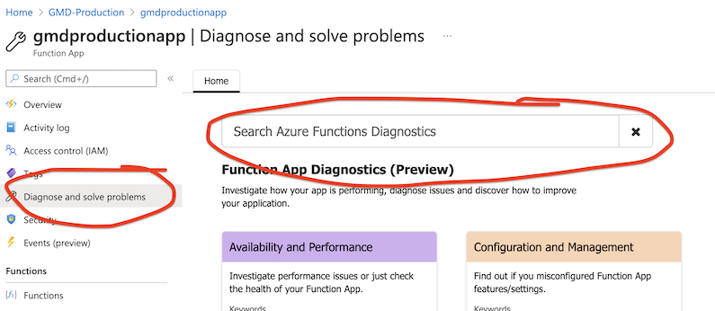
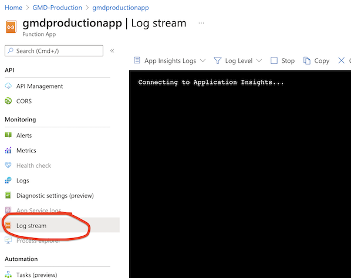
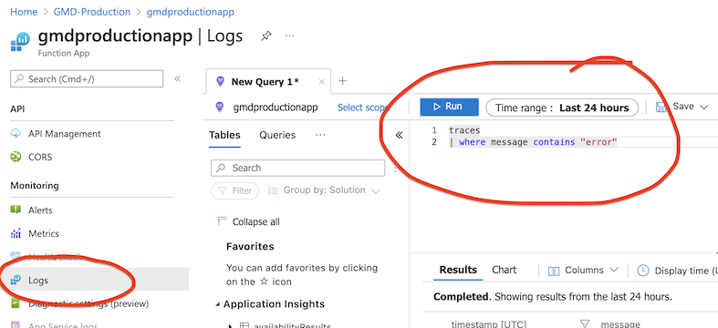
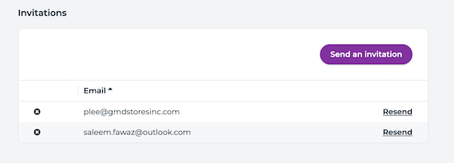
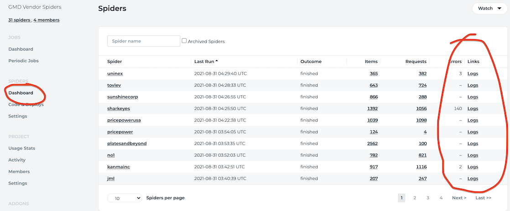

# How to access logs

We have many places to find logs. After this tutorial you will become a logging pro.

## Azure Function App

We have 2 Function Apps in production:

- `gmdproduction` - this holds Python document parsers
- `gmdproductionapp` - this is for backend, reporting, collecting scraping data

Both have the same way to access logs:

### Diagnose and solve problems

Quick and handy tool. Lots of pre-build by Azure reports. Type "Errors" and check standard reports.

### Log stream

Here you can check real-time logs generated by your application.

### Kusto queries (KQL)

The most powerful way to access logs – run KQL queries. Azure has a special request language for logs. It allows finding
small things in large quantities of logs. KQL is an easy language, you will be productive with it in 10 min, check
this [tutorial](https://docs.microsoft.com/en-us/azure/data-explorer/kusto/query/tutorial?pivots=azuremonitor).

Logs in Azure work this way:

- every application can write logs to Application Insights instance. We have 1 for prod and 1 for staging
- prod Application Insights names `gmdproductionapp`
- Application Insights can save massive amount of logs and allow run on them KQL
- cuz every application write to the same Application Insights instance you can at the same time query logs across the
  whole system

**How to know what logs to find?**

- Our repo consists mostly of Python code and TS code
- For Python search repo for `print(` statement. All pythons prints should be redirected to Application Insights
- For TS search repo for `log(` statement. Usually it `console.log(` or `context.log(`, these logs should be redirected
  to Application Insights
- Find a log statement you are interested in and put it into KQL query

## Zyte

In the Zyte cloud we run web spiders. To access it you need to be invited by an admin.

After you were added to the project you can find logs on the dashboard:

---
---

### :bulb: Help us to improve the Wiki
- Didn't find something?
- Explanations were not clear?

[Leave a feedback!](https://docs.google.com/forms/d/e/1FAIpQLScE_i7txZOlPgFhmnBOephz9hdhvnJDbXjmkKqnjRSjx_d8kg/viewform?usp=pp_url&entry.685765712=How-to-access-logs.md)

---

[What is your favorite hobby or a computer game?](https://forms.gle/X4U9Jni6s3hfSW8e6) Answer, and find out the 
answers of others! 

---

*Let's automate the world :earth_asia:*
