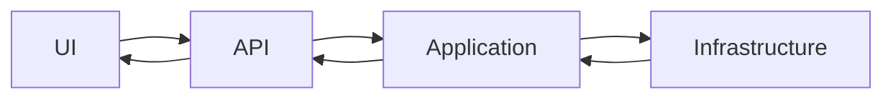
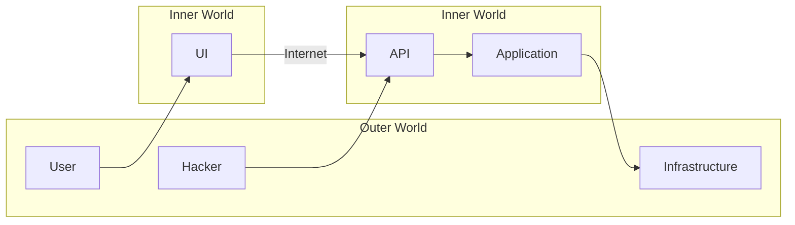
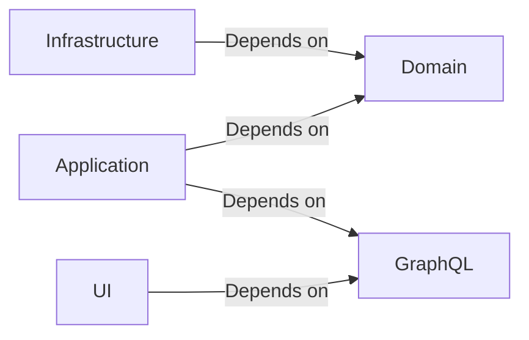

The goal of this article to teach you, how to add new features into our system. We assume you know:

- [Understand Software Architecture in 15 Minutes or Less
  ](Understand-Software-Architecture-in-15-Minutes-or-Less.md)
- [Vertical Slice Architecture](Vertical-Slice-Architecture.md)

We will learn:

- what parts our system consists of: features, layers, schemas, mappers
- how data moves between different layers
- how layers depend on each other
- what the difference between outer and inner layers
- what is and why do we use a schema

## System Overview

Our system consists of many features, however, they all follow a common theme:

- a user interacts with UI
- commands and queries send to a backend via an API
- the backend runs a computation
- the backend interacts with infrastructure:
    - retrieves/stores data in a persistence layer, eg, MSSQL
    - other third party services, eg, computer vision, analytics, etc
- the backend sends computation results back to UI

Sometimes there is no UI, but a program accesses another program, but the theme is the same:

- we have a distributed system, that consists of many independent features, and these features consist of layers. The
  most common layers are UI/API/Application/Infrastructure

## Layers

A separate feature often looks like this (arrows represent data flow):



It can be:

- UI: a user scans a UPC barcode with their phone
- API: a graphql request has being sent to a backend
- Application: the backend receives the request, validates and cleans UPC from whitespaces and calls corresponding
  infrastructure
- Infrastructure: we run several queries in MSSQL database and find a product's details by the UPC in multiple tables
- Application: validates infrastructure results, and stitches the results in a single product
- API: sends the product back to UI
- UI: shows the product to the user

UI/API/Application/Infrastructure – these things are called **layers**. These are not all the layers tho, we will
discuss more layers later.

## Data Shapes

Image you are making a social network. A user opens another user's profile. What does he see?

- name
- photo
- followers count
- etc

You can represent the user as a data object / you can model a user as a data object / data of a shape:

```typescript
type UserUI = {
  name: string
  photo: string
  followers: number
}
```

This is a UI layer user representation. Data of a specific shape.

Often each layer has a custom representation of the same phenomenon. For example the same user in a Persistent (MSSQL)
layer could be represented as:

```typescript
type UserMSSQL = {
  id: number
  name: string
  photo: string
  followers: number
  email: string
  password: string
}
```

Now it should be clear for your, why do we need 2 data types for representing the same phenomenon:

- UserUI should not have email/password available, they are private information
- UserMSSQL should have email/password available, cuz we need to store them for login validation

You also want to keep data models of each layer decoupled. If UserUI is decoupled from UserMSSQL then I can change "how
we store user" without affecting "how we display user". This is a crucial concept for stopping change propagation. This
is how we can scale our system, and still be able to change it with low cost.

On the other hand, we can use the same UserMSSQL model for UI, just keep email/password empty for security reasons. In
this case UI becomes coupled with Persistence layer. If we change "how we store user" it will affect "how we display
user". This is very dangerous, cuz even a small change can propagate through several system layers. In such architecture
with time changes will become exponentially more expensive, and we want to avoid such grim future.

As a conclusion:

- each layer has custom data shapes associated with it. These shapes represent / model phenomena
- we want these shapes to be decoupled from each other

## Mapping

Data travels from one layer to another, but each layer has custom data shape. This means, that data shapes should be
able to transform from one to another. Functions, that transform one shape to another, are called **mappers**.

```typescript
type TypicalMapper = (from: A) => B
```

Typical transformation looks like this:

```typescript
const usersGQL = usersMSSQL.map(toUserGQL)
```

When you update data model of a one layer, you should only update you're mappers, and the new change will be compatible
with the rest of your code. This small trick allows stopping change propagation.

## Inner And Outer Worlds

Let's gather what we have learned:

- the distributed system consists of features that follow a common layered pattern
- each feature consists of several layers, and these layers exchange with data
- each layer has custom data shapes / models associated with it
- to pass data from one layer to another, you should transform it with a mapper

Now then next interesting thing you should consider, that you can trust data in one layers, and don't trust in others.
You trust inner layers, and should validate and parse outer layers.

### Inner World

Inner world – something inside our system, under 100% of our control, something, that could be validated with TypeScript
compiler.

Imagine a User type:

```typescript
type User = {
  name: string
  photo: string
  followers: number
}

function foo(user: User): number {
  return user.followers / 2
}
```

Can we be sure, that this code will never crash?

All fields of a User could be validated by TypeScript compiler, eg, such construct will cause an error at compile time:

```typescript
foo({ name: 'test', photo: 'image.jpg', followers: '2' })
```

This is the true power of TS: we can tell during compile time if a program would crash or not. Look at this as on
millions free unittest that protect your program and sanity. This is the core of scalable software architecture.

Thus, if all instances of User type were created in places where TypeScript compiler could validate them, then we can be
sure that foo() will never crash.

### Outer World

However, in the real world we would like our programs to receive user's input. A user can easily send string instead of
number, and we will not be able to capture this error with TS compiler, because this error happens at runtime. For
example: you have a rest API and someone sends `https://domain.com/api?followers=lol`.

Usually functions, that retrieve data from external world, return `any` or `unknown` type, because TS compiler could not
make decisions about types that happens at runtime:

```typescript
const x = sql.query('SELECT * FROM table') // will return any/unknown type

// API callbacks will also have any/unknown types
function APICall(data: unknown) {
} 
```



### How Data Moves Between The Worlds

This cause some issues. In every system we want to move data from the external world to the inner world. However, it is
dangerous. The data should be validated and cleaned up on the borders of a system, before we can safely work with it. It
could look something like this:

```typescript
function APICall(followers: unknown) {
  let _followers
  if (typeof followers === 'string') {
    _followers = parseInt(followers, 10)
  }
  if (typeof followers === 'number') {
    _followers = followers
  }
  assert(typeof _followers === 'number', 'followers should be a number')
  assert(_followers >= 0, 'followers should be >= 0')
  assert(Number.isInteger(_followers), 'followers should be an integer')
  // ... here we can be sure that _followers contains good data ...
} 
```

What if you need to parse followers field in multiple functions? Then you wrap the common code into a function:

```typescript
function parseFollowers(followers: unknown): number {
  let _followers
  if (typeof followers === 'string') {
    _followers = parseInt(followers, 10)
  }
  if (typeof followers === 'number') {
    _followers = followers
  }
  assert(typeof _followers === 'number', 'followers should be a number')
  assert(_followers >= 0, 'followers should be >= 0')
  assert(Number.isInteger(_followers), 'followers should be an integer')
  return _followers
}

function foo1(followers: unknown) {
  const _followers = parseFollowers(followers)
  // ...
}

function foo2(followers: unknown) {
  const _followers = parseFollowers(followers)
  // ...
}
```

As a conclusion:

- the external world is messy and dirty. We can have malformed data there
- the inner world is tidy and clean. TS compiler will catch all the errors at compile time
- if we move data from external source, we should clean and validate it before use, or we will get crashes, or even SQL
  injections at runtime

## TypeScript Compiler Limitation: Complex Types Require Runtime Validation

You can easily catch such error with TS:

```typescript
const x: number = 'lol' // this will be highlighted with red color
```

However, what if you want to catch such errors:

```typescript
const x: OddNumber = 2
```

How can you define the type `OddNumber` that way, so TS compiler would show an error when you try to use an even number?
This part is tricky.

When you start having more complex type rules like `OddNumber`, `NonEmptyString`, `IntegerNumber`, `UPC` you will soon
discover, that those checks could only be performed during runtime.

Consider the following example:

```typescript
type IntegerPositiveNumber = number

function parseFollowers(followers: unknown): IntegerPositiveNumber {
  let _followers
  if (typeof followers === 'string') {
    _followers = parseInt(followers, 10)
  }
  if (typeof followers === 'number') {
    _followers = followers
  }
  assert(typeof _followers === 'number', 'followers should be a number')
  assert(_followers >= 0, 'followers should be >= 0')
  assert(Number.isInteger(_followers), 'followers should be an integer')
  return _followers
}

function foo(followers: IntegerPositiveNumber) {
  // ...
}

foo(parseFollowers(123)) // no error

foo(-123.123) // no error
```

Can we define `IntegerPositiveNumber` that way, so `foo(-123.123)` would be an error? Yes! For this we use Branding.

## Branding

This idea of branding is simple: we add a private field to a type:

```typescript
type IntegerPositiveNumber = number & { __brand: 'IntegerPositiveNumber' }

function parseFollowers(followers: unknown): IntegerPositiveNumber {
  // ...
  return _followers as IntegerPositiveNumber
}

function foo(followers: IntegerPositiveNumber) {
  // ...
}

foo(parseFollowers(123)) // no error

foo(-123.123) // error, the brand is missing
```

This is extremely powerful technique. Now we could be sure that all instances of `IntegerPositiveNumber` were created
with a parse function. Also, we usually move `__brand` field to a private class field like this:

```typescript
class IntegerPositiveNumberBrand {
  private readonly __brand: 'IntegerPositiveNumber'
}

type IntegerPositiveNumber = number & IntegerPositiveNumberBrand
```

This way you could not make an instance of `IntegerPositiveNumberBrand` object without `as` cast or `@ts-ignore`.

## Parse, Don’t Validate

Our data architecture is inspired by a famous
[Parse, don’t validate](https://lexi-lambda.github.io/blog/2019/11/05/parse-don-t-validate/) article. Consider the
following more traditional way of validating user input:

```typescript
function APICall(followers: unknown) {
  validatePositiveInteger(followers)
  const _followers = followers as number
  // ... here we can be sure that _followers contains good data ...
}

function workWithfollowers(followers: number) {
  validatePositiveInteger(followers)
  // ...
}
```

Also, we have validated user input on boundaries of our system, but we have lost this validation information.

Function `workWithfollowers` needs to double-check, that its input is in fact valid `followers` number. Usually develops
skip the second validation tho because it's a hassle. So the system grows, and amount of functions grows, and all these
functions work on the assumption that followers is a positive integer, but never actually check it. This leads to hard
to find bugs.

What we should do instead is to parse:

```typescript
function APICall(followers: unknown) {
  const _followers: PositiveInteger = parsePositiveInteger(followers)
  // ... here we can be sure that _followers contains good data ...
}

function workWithfollowers(followers: PositiveInteger) {
  // ...
}
```

This way we preserved the parsing information, and can be sure, that followers inside `workWithfollowers` is actually a
PositiveInteger. If it is not a PositiveInteger, TS compiler will show us an error.

## Schema

The Schema is the heart of our system, before we talk about it, let's gather what we have learned:

- the distributed system consists of features that follow a common layered pattern
- each feature consists of several layers, and these layers exchange with data
- each layer has custom data shapes / models associated with it
- to pass data from one layer to another, you should transform it with a mapper
- if you pass data from outer world inside your system, you need to clean and parse the data
- to preserve the parsing information you should create and pass around a custom branded type

We have seen as parse functions as `parsePositiveInteger()` can produce handy branded types from `unknown` data.

Now, let's talk about a schema. A schema is a mapper function, that parses and validates data. It can also transform the
data, but also may only validate it without transformation. If data is invalid, the schema throws an exception.

```typescript
type SomeSchema = (from: A) => B
```

For example, we can have a `stringSchema()`:

```typescript
// This thing can construct a string from many other types
function stringSchema(x: string | number | boolean | object): string {
  // ...
}

console.log(stringSchema(123)) // >> '123'

stringSchema(undefined) // will throw an exception
```

We can also use function composition to construct more complex schemas. Assume you know
that `pipe(f1, f2)(x) = f2(f1(x))`:

```typescript
export const NonEmptyStringSchema = pipe(
  stringSchema,
  refineMin(0), // will throw, if len() is less than 0
  hasBrand('NonEmptyString'), // adds a brand
)

console.log(NonEmptyStringSchema(123)) // >> '123'

NonEmptyStringSchema('') // will throw exception
```

Using TS magic we can infer schema type:

```typescript
type NonEmptyString = InferSchemaType<typeof NonEmptyStringSchema>

function foo(str: NonEmptyString) {
  // you can be damn sure, that str is a non empty string
  // thus str[0] - is always a safe operation, you may skip some checks
}
```

Let's go a step further and think of how can we parse more complex types like this:

```typescript
type UserMSSQL = {
  id: PositiveInteger
  name: NonEmptyString
  photo: URL
  followers: PositiveInteger
  email: Email
  password: Password
}
```

We can define `objectSchema()` function, that constructs a mapper, that allows map from some arbitrary data to a
specific shape:

```typescript
type UserMSSQL = InferSchemaType<typeof UserMSSQLSchema>
const UserMSSQLSchema = objectSchema({
  id: PositiveIntegerSchema,
  name: NonEmptyStringSchema,
  photo: URLSchema,
  followers: PositiveIntegerSchema,
  email: EmailSchema,
  password: PasswordSchema,
})

// and like this, will gurantee to have an array of users of the correct shape
// with function composition we can define compex rules, like:
// - should we throw away invalid users and continue?
// - or should we stop transformation and raise an error?
const users: UserMSSQL[] = arraySchema(UserMSSQLSchema)(
  sql.query('SELECT * FROM Users')
)
```

Function composition allows us define complex rules, like adding optional fields:

```typescript
const UserMSSQLSchema = objectSchema({
  id: PositiveIntegerSchema,
  name: optional(NonEmptyStringSchema),
})
```

Schemas allow building extremely powerful types like this:

```typescript
// cleaning string from whitespaces, html, and normalizing the price to 2 digits
console.log(PriceSchema(' <b>   123.12333  </b>  ')) // 123.12
PriceSchema(-123.23) // will throw, cuz a price could not be less then 0
```

Cleaning, parsing, validating, normalizing is extremely crucial for our business: we collect data from websites and
paper documents. The data often malformed or contaminated. Schema allows us to have data be cleaned and validated in
uniform convenient way.

### Schema is a Stackable Funnel

- A schema should have a funnel shape: (many types) -> one type
- A schema should be named as a type it produces

If your schemas can consume many types, and produce one type, this will allow schemas become stackable.


### Async Schema Support

In theory, you should be able to build something like this:

```typescript
async function longAsyncCheck(x: string) {
  await sleep(1000)
  return x.length > 0
}

const AsyncSchema = pipe(
  stringSchema,
  refine(longAsyncCheck),
  hasBrand('AsyncSchema')
)

const ComplexAsyncSchema = objectSchema({
  asyncField: optional(arraySchema(AsyncSchema)),
})

async function main(data: unknown) {
  const object = await ComplexAsyncSchema(data)
  const array: string[] | undefined = object.asyncField
  // ...
}
```

However, it is extremely hard to shape TypeScript to work this way. Your
pipe/optional/hasBrand/refine/arraySchema/objectSchema should support both normal and async functions. Eg, when
objectSchema encounter an async member, it transforms from a normal function, to an async function. The most hard is
pipe, which can take weeks to make right.

I propose to keep things simple, and do not implement all the schema operators, but only easy operators:

- I propose implement `hasBrand()` to work with async functions, eg, it will apply brand on an inner type
- Use `refineAsync()` when you need refine with an async function
- Update `optional()` to support async [NOT IMPLEMENTED YET]

It can look like this:

```typescript
async function longAsyncCheck(x: string) {
  await sleep(1000)
  return x.length > 0
}

type AsyncType = InferSchemaType<typeof AsyncSchema> // eg, Branded<string, "AsyncSchema">
const AsyncSchema = pipe(
  stringSchema,
  refineAsync(longAsyncCheck),
  hasBrand('AsyncSchema')
)

const ComplexAsyncSchema = objectSchema({
  asyncField: AsyncSchema,
})

async function main(data: unknown) {
  const object = ComplexAsyncSchema(data)
  const field1: AsyncType = await object.asyncField

  // You can await the same promise multiple times, this will return a cached result
  const field2: string = await object.asyncField

  // ...
}
```

## Layers' Rules

Recap:

- the system consists of features
- features consist of layers
- layers consist of schemas and mappers
- layers exchange with data

The goal of a good architecture is to stop change propagation. To fight the change propagation we use several layer's
rules:

### Move Only Stable Business Concepts to a Domain Layer

This way Domain will form a stable core. If we have a stable Domain layer, we can depend on it without fear, that it
will change.

We isolate the most stable schemas and functions in a domain layer. This layer should capture the business essence. For
example what Price is, or what a valid UPC is are highly stable concepts. On the other hand what table do we use to
store data prone to change. This is why we move PriceSchema and UPCSchema to a Domain, and keep table related data in a
Persistence layer.

When moving stuff to a Domain consider this: would this stuff exists even if we did the business with pen and paper? If
the answer is Yes, then most likely this is a domain concept.

### Domain Should Not Depend on Any Other Layer

This way Domain will form a stable core. If we have a stable Domain layer, we can depend on it without fear, that it
will change.

### Layers Should Follow Dependency Rules



As you can see, domain acts like glue that stitched other layers together. This way we can write an application logic
without thinking of implementation details of infrastructure.

GraphQL schema also stitches UI with Application, this way we can change UI without changing the application and vice
versa.

## Conclusion

In this article you have learned that:

- our system contains of features
- each feature contains of layers
- each layer defines custom schemas and mappers
- layers exchange data by transforming from one schema to another with a mapper function
- if you pass data from outer world inside your system, you need to clean and parse the data
- schemas clean and parse data
- to preserve the parsing information you should create and pass around a custom branded type
- to stop change propagation with use layer's rules:
    - move stable business concepts to a domain layer
    - domain could not depend on any other layers
    - layers should follow dependency rules

## What's next

- [TypeScript Dependency Injection](TypeScript-Dependency-Injection.md)

Now that you have learned the architecture basics, you can dive into study of each separate layer:

- application
- ui
- domain
- infrastructure

---
---

### :bulb: Help us to improve the Wiki
- Didn't find something?
- Explanations were not clear?

[Leave a feedback!](https://docs.google.com/forms/d/e/1FAIpQLScE_i7txZOlPgFhmnBOephz9hdhvnJDbXjmkKqnjRSjx_d8kg/viewform?usp=pp_url&entry.685765712=Introduction-Into-TS-Vertical-Slice-Architecture.md)

---

[What is your favorite hobby or a computer game?](https://forms.gle/X4U9Jni6s3hfSW8e6) Answer, and find out the 
answers of others! 

---

*Let's automate the world :earth_asia:*
