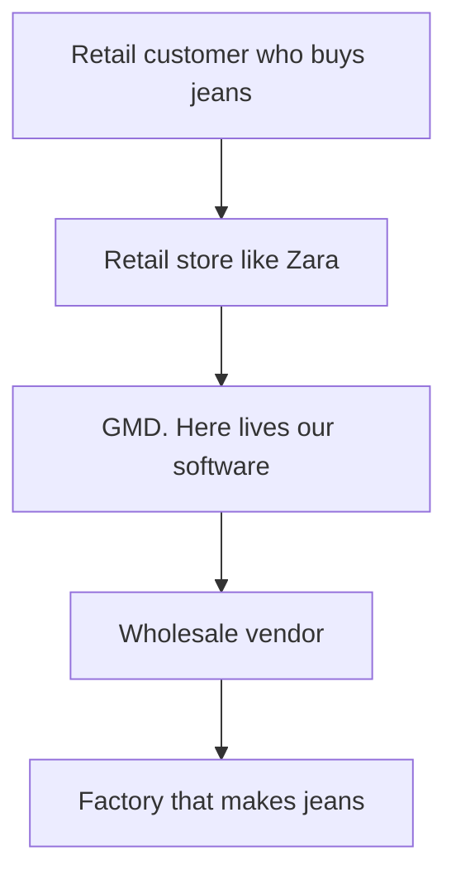
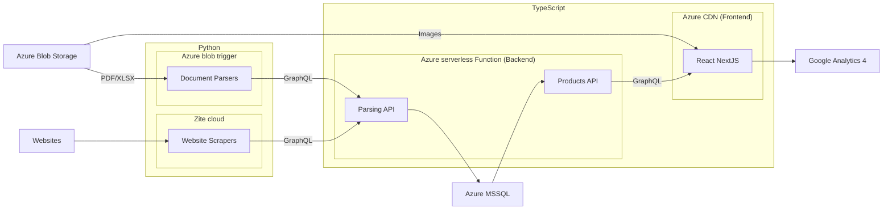

Welcome to the Scrapy repo!

# Introduction

## 0. Use timer

We like to track any time spend on stuff related to our project. This includes:

- reading the documentation
- phone calls
- debugging code
- learning new skills related to the project
- etc

## 1. What we are doing

There are hundreds of e-commerce websites. These websites have products. We want to grab these products and put them
into our database.

There also hundreds of emails with PDFs with products. We want to grab these products and put them into our database.

We provide UI to access this data.

## 2. Why we are doing it

- There is a company named GMD. We are making software for this company
- GMD is an intermediate between Retail stores and Wholesale vendor

- There is a growing divide of poor and rich in the USA. Much more poor people, and it is getting worse. If we can get
  these people products at an affordable price without chasing margins, we will change society for the better. Current
  systems in the retail industry suck:
  people use pen and paper to do their daily tasks, which is extremely inefficient. We want to automate the retail
  industry, make life of workers easier, and the prices lower for the end consumer. We want to make a system where
  Retail Stores could smoothly order products from Wholesale Vendors.
- To provide this service we need to collect all the products the Wholesale Vendors sell in our database
- If GMD complete the system, and shows good numbers to investors, it will receive $100M in funds, scale software
  production, and our life will be sweet as honey

## 3. How we are doing it

- We have web/document parsers that collect data and push the data to [Parsing GraphQL API](Parsing-GraphQL-API.md).
  This part is written in Python
- The Parsing API pushed data to database. This part is written in TypeScript
- We have frontend/backend that can read/display the data to end users. This part is written in TypeScript
- The frontend is connected to [Google Analytics 4](Google-Analytics.md), that collects data of user interactions.
  Provides us insides of user behavior
- We follow DevOps ideology. Our CI/CD will automatically deploy staging and production environment from your git
  commits. We collect use's feedback

As you can see we have 2 main languages: Python and TypeScript

- Python is easy to work with. Programs are compact, unit tests are compact, environment is easy to work with. Warm and
  nice experience. But Python has no types. Lack of types limits usability of Python to borders of our system
- TypeScript has steep learning curve. Programs are a bit bulky, you need write boilerplate. However, TS has extremely
  powerful type system, which makes TS perfect for our system core. We
  use [Vertical Slice Architecture](Vertical-Slice-Architecture.md) in the TS part

Python and TypeScript splits our system into 2 main parts:

- part that collects data
- part that processes data

### Web scraping with Scrapy

- There is a python tool named [Scrapy](https://scrapy.org/)
- This tool allows run [Spiders](https://en.wikipedia.org/wiki/Web_crawler) in [Zyte](https://zyte.com/) cloud
- Spiders are small python programs. They crawl websites, collect products from the websites, and store results in the
  cloud
- There are hundreds of different websites. Each website is unique. So we need to make a custom Spider for each website
- Scraped products are initially stored in the Zyte cloud. Then they are transferred to Azure cloud, where the data
  could be used by our system

### Scraping paper documents with Document Scrapers

- There are paper documents and PDFs with product listings
- There are dozens of different document formats, each vendor provides custom design for his PDF listing
- We push these documents to Azure blob storage. It's like a sizeless folder in a cloud
- We can attach code to add/update blob storage events, eg, we can attach code that fires when a new document added
- This code can be run serverless, eg, we have unlimited computing power without the hassle of infrastructure
- These serverless functions extract attachments from emails and perform OCR on PDFs and images
- After we have extracted OCR data we can extract product images and data and push them to our database

All the data, that was scraped by spiders and parsers, is being sent to [Parsing GraphQL API](Parsing-GraphQL-API.md).
From there it is being processed and stored.

### React Frontend

Is a Progressive Web APP. A React NextJS app compiled and then distributed via Azure CDN. It is a website, eg the same
app can be opened with tablet, mobile, or laptop. All the content is static, eg, it can be distributed with a CDN.

### Node Backend

Our system's core. Heavily relays on TS type system and a custom schema.
Follows [Parse, don’t validate](https://lexi-lambda.github.io/blog/2019/11/05/parse-don-t-validate/)
ideology.

## 4. Your job

Help to build this system. You are expected to be [proactive](Proactivity.md), and find ways to improve the system
yourself. This means:

- Freedom. You free to work as you like, in any time you like, you can skip all meetings you don't like, you can learn
  what you like, you can tell your opinion, etc. And we will pay for all these hours you spend on the project.

### What your management wants

- The most important thing in your work is impact. You are expected provide big impact on the system, and bring lots of
  value for the business. These terms are fuzzy, eg, there is no solid definition for an impact, but when you bring one,
  people around you feel it. Your good work charges your colleagues with energy and determination
- You should constantly lear and improve your craft. Feel free log Upwork time for learning, if it is related to your
  work. Don't know TypeScript but want to help us with it? We will pay for your time you learn it, as long as you
  provide impact for the system
- You should find valuable things to do yourself. An ideal team member is [proactive](Proactivity.md): produces huge
  impact without need of micromanagement. In the beginning senior devs will provide you with tasks to do, but as you
  grow you should be able to find tasks yourself. There are always things to improve in the system. You should find the
  most impactful tasks and do them. To know what things are more impactful you should understand the current business
  goals. This means communicating with teammates and the business
- As you grow you should start code less, and write more documents. We do not micromanage our developers. Instead,
  senior developers write documents that explain current system context and business goals. Knowing context and business
  goals developers can find impactful things they can do with their current skill set. This approach is extremely
  scalable, especially for 100% remote teams in multiple timezones. To hundreds of devs scalable
- You are expected to receive and give honest feedback to/from all your colleagues. Learn how receive and give feedback
  with [Feedback Loop](Feedback-Loop.md) guide, this will help you to grow

Don't worry, you may start small, and then step by step improve your understanding of GMD's business model, the current
system, and how to improve it.

To start check our [Agile Workflow](Agile-Workflow.md)

# Our values

These are the core values we agreed on and follow in day-to-day life. If not sure on how to act in a difficult
situation, make the values check:

- We produce value and improve people's life
- We respect honesty
- We respect [proactivity](Proactivity.md)
- We respect people who are not afraid to ask questions if don't know something
- We respect people who admit that they were wrong
- We prioritize product quality, and proud of our product
- We are not keeping silent if feel that something is wrong. We draw everyone's attention to the issue
- If we see an issue we fix it. We do not wait till it will be fixed. We consider everything as our job
- We all produce imperfect code, that will be reviewed, criticized, and changed by others. We try not to attach our ego
  to code or a specific solution
- We constantly learn and train our craft

# What's next

- [Feedback Loop](Feedback-Loop.md)
- [Repository Overview](Repository-Overview.md)
- [Scalable Software Development Guide
  ](Scalable-Software-Development-Guide.md)
- [How to Develop Scrapy Spiders](How-to-Develop-Scrapy-Spiders.md)
- [How to Develop Document Scrapers](How-to-Develop-Document-Scrapers.md)
- [How to Develop TypeScript backend](How-to-Develop-TypeScript-backend.md)

---
---

### :bulb: Help us to improve the Wiki
- Didn't find something?
- Explanations were not clear?

[Leave a feedback!](https://docs.google.com/forms/d/e/1FAIpQLScE_i7txZOlPgFhmnBOephz9hdhvnJDbXjmkKqnjRSjx_d8kg/viewform?usp=pp_url&entry.685765712=Onboarding-Guide.md)

---

[What is your favorite hobby or a computer game?](https://forms.gle/X4U9Jni6s3hfSW8e6) Answer, and find out the 
answers of others! 

---

*Let's automate the world :earth_asia:*
