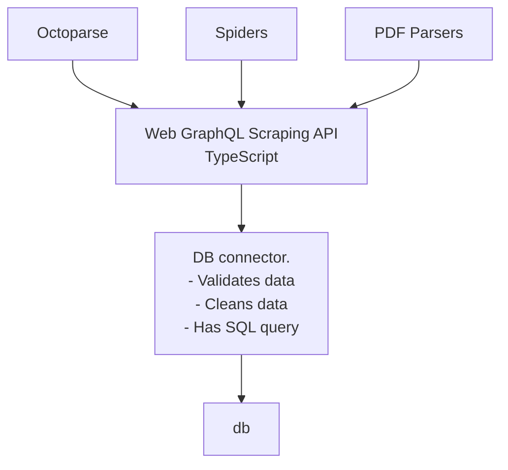
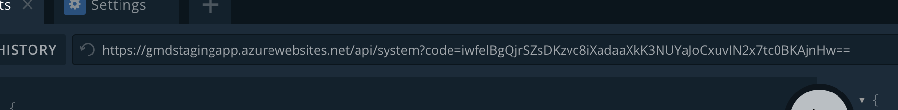

Our system looks like this



All scrapers grab data from external resources and push it in a dirty form to a single API endpoint. At the API endpoint
the data is being cleaned and stored in our db.

The data looks like this:
A table with:

- VendorID - id of a store, you can check
  them [here](https://docs.google.com/spreadsheets/d/1XH-0lDKJGNBxR6ThLQ_MrCx5RTKB17gzcXO50GWWOr8/edit?usp=sharing)
- ItemNO - unique id of an item in the store
- UPC - barcode. This thing could be scanned with a barcode scanner. Should be registered in international authority.
  Has check sum
- Price
- Description
- ImageUrl
- SourceUrl - where we have found this product
- CasePack - package
- Bucket - a type of the product, eg, Cosmetics, Toy

## How to send data to the endpoint via UI

You can play around with API connected to IProcessor_test
with [this link](https://gmdstagingapp.azurewebsites.net/api/system?code=TqgF9vW2/ckInrUqa7cFHUnGkCDstRpFxa5m1riTE9rr1D1DSocMUA==)

- Check the top of the screen, it should has this thing in path

```
https://gmdstagingapp.azurewebsites.net/api/system?code=TqgF9vW2/ckInrUqa7cFHUnGkCDstRpFxa5m1riTE9rr1D1DSocMUA==
```



Typical graphql request looks like this

```
mutation {
  addProducts(input: {products: [
    {
      vendorId: "1",
      itemNo: "test item",
      upc: "<a> 6254352345234 </a>"
    },
    {
      vendorId: "1",
      itemNo: "test item 2",
      upc: "<a> 6254352345234 </a>"
    }
  ]}) {
    success
    message
  }
}
```

As you can see you can send dirty data: with whitespace and HTML tags. Don't worry, the data will be cleaned by the API.

Or this, if you want to use variables. You will need to specify `$products` variable.

```
mutation scrapy($products: [AddProductInput!]!) {
  addProducts(input: {products: $products}) {
    success
    message
  }
}
```

Copy and try it. While typing you can press CTRL+Space and get autocompletion of field names

## How to send data to the endpoint with a program

### Curl

```
curl 'https://gmdstagingapp.azurewebsites.net/api/system?code=TqgF9vW2/ckInrUqa7cFHUnGkCDstRpFxa5m1riTE9rr1D1DSocMUA==' \
  --data-raw $'{"operationName":"scrapy","variables":{"products":[{"vendorId":"1","itemNo":"test item","upc":"<a> 6254352345234 </a>"},{"vendorId":"1","itemNo":"test item 2","upc":"<a> 6254352345234 </a>"}]},"query":"mutation scrapy($products: [AddProductInput\u0021]\u0021) {\\n  addProducts(input: {products: $products}) {\\n    success\\n    message\\n  }\\n}\\n"}' \
```

### Other

Google `GraphQL ____ API`. You also can send this requests as JSONs via HTTP post.

---
---

### :bulb: Help us to improve the Wiki
- Didn't find something?
- Explanations were not clear?

[Leave a feedback!](https://docs.google.com/forms/d/e/1FAIpQLScE_i7txZOlPgFhmnBOephz9hdhvnJDbXjmkKqnjRSjx_d8kg/viewform?usp=pp_url&entry.685765712=Parsing-GraphQL-API.md)

---

[What is your favorite hobby or a computer game?](https://forms.gle/X4U9Jni6s3hfSW8e6) Answer, and find out the 
answers of others! 

---

*Let's automate the world :earth_asia:*
