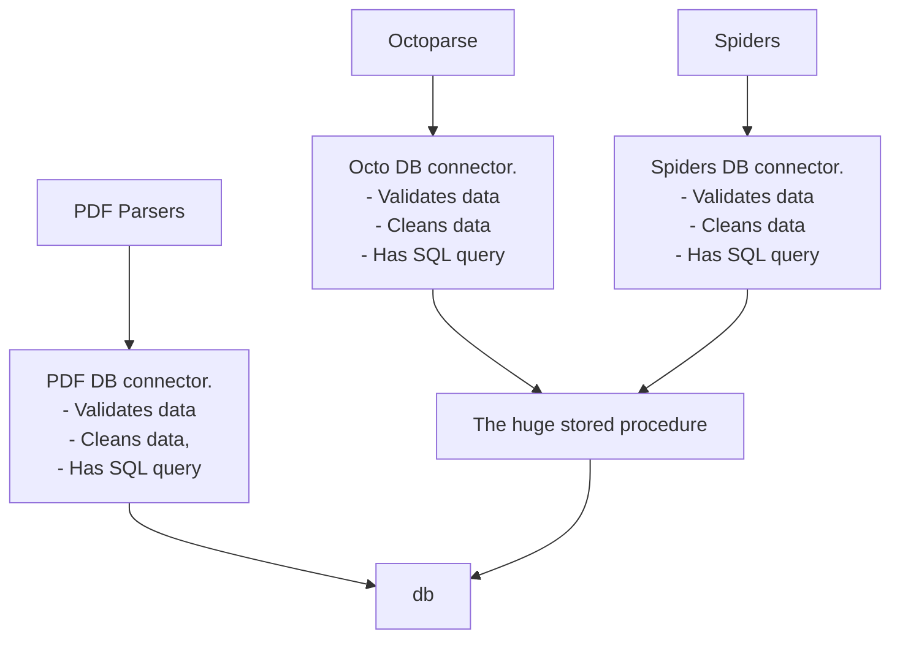
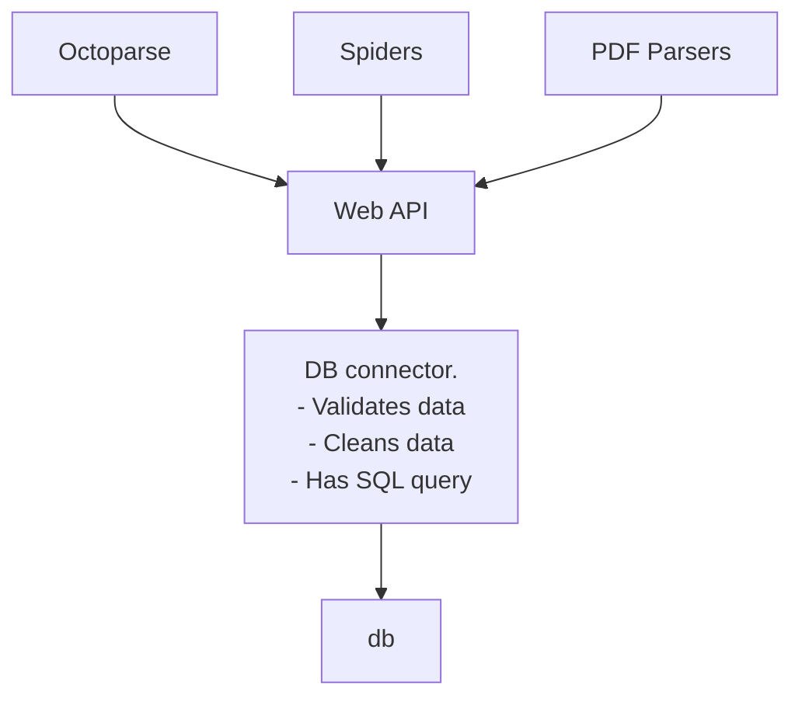

## Current system
We are collecting product data from multiple sources: web scrapers, pdf scrapers, octoparse, etc. Lots of different sources. Currently, it happens like this:
- Each source writes to db, sometimes in a different table
- Each source should validate and clean data
- Then we have a huge stored procedure there, which merges all this data into one table

## Issues with the current system
- When data models change, we suffer a lot. And the data model will evolve with business requirements. Currently, we need to update the data model to store all product's history. This means, that each data source should be updated, which is not scalable
- There is complex logic involved in data storage. UPC validation, different storage conditions, ifs. Basically, we have a huge SQL file with a stored procedure, that in 7 steps does its magic. SQL is awesome for storing/searching data. But when it comes to logic/conditions it is painful to work with SQL. This is not scalable
- No tests. Each modification in the data model requires you to manually test all the edge cases. This is not scalable

## Datasource unification
What I prose to do, is to extract a separate persistence layer with SQL and tables. And all the data sources will work with this layer via a unified API endpoint.

We use the fact, that API is a stable part of the system, it doesn't change a lot. You will always scrape UPC, images, and descriptions. You may ADD new fields, but will most likely not remove old ones.

However, the way we store the data or process the data is unstable and will change a lot. That's why all the storing/processing stuff should be isolated in one place, that will be covered with tests. This way on new change the change will be contained in one place, and will not propagate to all the data sources.

This way if:
- Datamodel updates -> we need to update only one point
- Complex logic? Easy! Our connector is written in a general-purpose typed language, eg TS
- Test? Easy! Our connector is written in a general-purpose typed language, eg TS
- All the code is actually in git and can be deployed to production or staging environment

This way:
- Updating the data model is cheap
- System has far fewer bugs, cuz we have tests
- We can modify the system without fear of breaking something, cuz we have tests
- No SQL in parsers, eg, parsers are easier to make and update
- All the validation and cleaning are unified in one place, eg, sources are easier to make and update
- Adding new sources is cheap
- In the future, we will have sources with thousands of UPCs updates/minute. We can update our connector to support the queue and handle this load

With the new model code updates become cheap. Our system welcomes change, not afraid of it. This is the game-changer.

I feel that this model is far more scalable than the current one, and we have a good opportunity to update it.

## Multiple UPC for the same product
Now we have all our data unified in one stream. 

The sources can send the same data via the Web API multiple times, this is the expected behavior. Like, if we run a Spider daily on the same Website it will produce the same API calls daily - this is expected.

Now, the connector has the power to decide, how to handle data duplication or data change. Currently, we expected to keep all the history data, if it updated, and discard it if it the same.

As for the SQL layer, I propose this database structure:
A table with:
- id - unique autoincrement key
- CreationTime
- VendorID
- ItemNO
- UPC
- Price
- Description
- Description2
- ImageUrl
- SourceUrl (from where we got the data)
- CasePack
- Bucket

The connector will just dump all our data in this table. So, each item will have multiple rows. The last row is the "current state", other rows - "history". 

Now, the issue here, that we don't want to store duplicates if the state didn't change. How to handle it?
- before insert, we can request the latest record and compare it with inserted data
- we can make [VendorID, ItemNO, UPC, Price, Description, Description2, CasePack, Bucket] unique index
We have full freedom of changing this implementation, it will not affect data sources. I expect people that have a deeper knowledge of SQL to handle this. But the table should be one, and it should have multiple rows for an item.

_Maxim: This table will be very "hot", as long as you offer to execute a select query before each row insertion._
_And it will become clumsy upon reaching a volume of 1M rows_

_This complex index won't help to make selects fast_

_In fact, selects are fast when tables are short_

_As long as you offer to keep all historical data, 
I'd offer to keep it in a separate table and not execute select statements upon the "stale" arrays of data_

_This is more complex, but thus we can avoid overweighting the table_

_In fact, we have already done something similar in the Inventory database_
_We've done it with a buffer table. All data first comes into the buffer, 
then insertion-trigger does his job of insertions/deletions/updates of data in the target table_

_This insertion-trigger does its job very close to the data and that's why it does it very fast. There're minimal time delays_

_And this complex index shouldn't be unique. Consider the situation: Description from "A" was changed to "B". We loaded new data. Then the description becomes from "B" to "A" again._

### Multipart data sources
There is also an important thing to notice:
- we can receive 1 item state with 2 API requests

There are vendors that have PDFs of 2 types:
- with itemno and images
- with itemno and UPC
This means, that we can't send data to API with 1 request. There will be 2 calls: with UPC and with Image.

The connector will decide, how to merge incoming data. 

A regular provider, all the data comes in a single API request:
- API receives {ItemNo: "1", UPC: "1234", Image: "https://image/1.jpg"}

A complex provider. There are two types of data sources for it. Part of the data comes from 1 request, part from the second:
- API receives {ItemNo: "1", UPC: "1234"}
- API receives {ItemNo: "1", Image: "https://image/1.jpg"}

All these requests are repeated daily, cuz we keep reparsing to catch updates. 

How to handle at the same time:
- history updates
- multipart items

### 1. Skip the same state

API calls:
- {ItemNo: "1", UPC: "1", Image: "https://image/1.jpg"}
- {ItemNo: "1", UPC: "1234", Image: "https://image/1.jpg"}
- {ItemNo: "1", UPC: "1234", Image: "https://image/1.jpg"}
- {ItemNo: "1", UPC: "1234", Image: "https://image/1.jpg"}

History:
- {ItemNo: "1", UPC: "1", Image: "https://image/1.jpg"}
- {ItemNo: "1", UPC: "1234", Image: "https://image/1.jpg"}

### 2. Multipart item
If field updates, we create a new record.

API calls:
- {ItemNo: "1", UPC: "1234"}
- {ItemNo: "1", Image: "https://image/1.jpg"}
- {ItemNo: "1", UPC: "1234"}
- {ItemNo: "1", Image: "https://image/1.jpg"}
- {ItemNo: "1", Image: "https://image/2.jpg"}
- {ItemNo: "1", Image: "https://image/2.jpg"}
- {ItemNo: "1", UPC: "1234"}

History:
- {ItemNo: "1", UPC: "1234", Image: NULL}
- {ItemNo: "1", UPC: "1234", Image: "https://image/1.jpg"}
- {ItemNo: "1", UPC: "1234", Image: "https://image/2.jpg"}