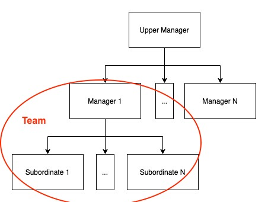
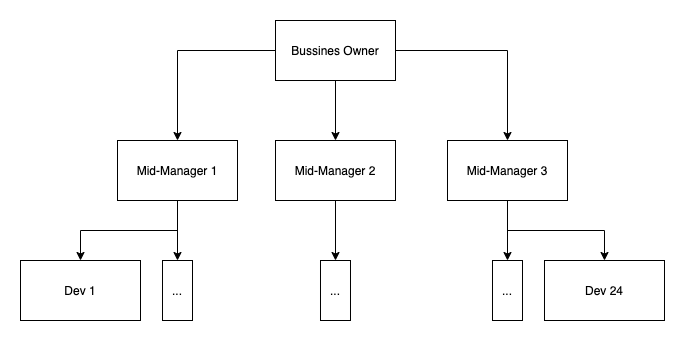

# Scalable Dev Team Structure: How to build software on a Facebook/Amazon scale

How one can organize a dev team to build something on a scale of Facebook or Amazon? How can one even begin to think
about it? The task seems pretty intimidating. Building Facebook or Amazon is a journey ofc – endless amount of details
to uncover and mistakes to make. Fear not, in this article I will give you a solid foundation on how to think about
scalable software teams and how to build them.

I firmly believe that we will produce an awesome organization, if combine experiences of two branches: the business and
the dev.

## How many devs do you need to build on a scale of Facebook?

The first question you want to answer: how many people do I actually need? Corporations don't publish their actual
numbers, we can only find rumors in Google that the number is from 250 to 2000. Let's use rough estimations to guess the
number of devs needed. I like to move in the power of 10 to estimate a magnitude. Good starting point: not 10, not 100,
but maybe 1000, cuz 10,000 seems too damn high.

We can double-check 1000 devs theory from another angle. If we know, how many lines of code Facebook is. If we know, how
many lines one dev can write a day. If we assume time to develop a Facebook. Then we can get the total number of devs
needed. Follow me:

- number_of_devs = total_lines_of_code / dev_lines_of_code_a_day / time_to_develop

Let's assume time_to_develop of our "Facebook". If we take 1 year, then it feels too unrealistic. If we take 10 years,
then our ideas can become outdated, I feel they will miss the market timing. Let's take a number between 1 and 10, for
example 5. Totally arbitrary number, however, it in the right range. We also assume that devs work 5 days a week, and
take a month of vacation, or 230 days a year.

Let's assume total_lines_of_code of our "Facebook". I found a cool chart that
claims [Facebook consists of 60 million line of code](http://interactive.io/wp-content/uploads/2014/05/1276_lines_of_code5.png)
. We are talking about millions for sure.

Let's assume dev_lines_of_code_a_day. Moving in powers:

- 1 - too low
- 10 - so-so
- 100 - seems like a very good workload, but you need to be also very good
- 1000 - unrealistic, in my top day I did about 500, and it took 12 hours

The answer is between 10 and 100, about 50. We can double-check this number
with [article1](https://blog.ndepend.com/mythical-man-month-10-lines-per-developer-day/)
and [article2](https://medium.com/modern-stack/how-much-computer-code-has-been-written-c8c03100f459).

Now we have all our numbers, let's calculate number_of_devs:

- number_of_devs = 60,000,000 / 50 / (5 * 230) = 1043

Holly molly, I swear to God I did not expect to hit so close to 1000. This is a miracle.

Let's conclude:

- by searching "how many developers Facebook has?" we estimated then the number is around 1000
- by counting lines of Facebook's code we have estimated the same 1000
- to build on a scale of Facebook you need 1000 devs

## How to manage 1000 developers to build on a scale of Facebook?

I feel that everyone agrees, that 1000 should be split into teams and managed in a hierarchical fashion. Hierarchy is a
go-to method corporations use to organize their people in an efficient way:

- A manager has N direct reports. He reports to one upper manager. Ofc, in reality, there are numerous nuances, and
  different collective structures in a corporation, double reporting, etc, but for our estimations we assume a simple
  tree hierarchy

How big should be a one team size? If we
use [Intel CEO experience](https://www.amazon.com/High-Output-Management/dp/B08Z8K64S2/ref=sr_1_3?dchild=1&keywords=managing+intel&qid=1629313830&sr=8-3)
, then one hands-on middle manager can handle 6-8 direct reports. 4 direct reports would be too small of a load, 10 -
too big, he needs to have time to do other activities. We will talk later why the manager should be hands-on. Let assume
for now that a team is 8 people.

We can start to build rough estimations of our corporate chart:

- level 1: 1000 developers. Can be split in 125 teams of 8. And need 125 managers to direct them.
- level 2: 125 managers. Can be split in 16 teams of 8. And need 16 managers.
- level 3: 16 managers. Can be split into 2 teams of 8. And need 2 managers.
- level 4: 2 managers. Directly report to the business owner.
- the top level: the business owner. I assume that the BO can handle up to 3 direct reports from the dev team, cuz he is
  also busy with other branches of the business.

As you can see, 4 levels will be enough to build software on scale of Facebook or Amazon.

## Road map: From a small group to a Facebook scale

1. Currently, we have levels 1 and 2. Assuming the business owner can handle 3 direct reports, it gives us 24 devs in
   total. This is a good starting point. The thing feels agile/fast/flexible, with a potential to grow bigger. On this
   level we can develop inner tools, automations, applications, and drive huge profit for the company.

2. Starting level 3 we start make a noticeable impact in the world. With 1 level 3 manager we can handle 64 devs, which
   is enough to build [Large Hadron Collider](http://interactive.io/wp-content/uploads/2014/05/1276_lines_of_code5.png)
   software. It has 3M lines of code, with 64 devs you can make it in 5 years.

3. With 3 level 3 managers we can handle 192 devs 11M lines of code, this is a level of Google Chrome Browser or
   Quickbooks, this software is on the world scale for sure.

4. Level 4 is a Facebook scale, something so big, that is shapes humanity itself.

Levels 3 and 4 are far away from us, they are vague. I can a bit imagine 3, but 4 has challenges above my current
comprehension. Good news – we do not need levels 3,4 right now, we can think of them later.

Levels 1,2 could be implemented right now, and with a huge profit for our organization. Let's focus on levels 1,2 and
shape details for them. Let's discuss a dev teams in details.

## Dev Team Structure (Level 1,2)

1 hands-on middle manager + 8 direct report devs = make a dev team. What structure should such a team have? Before you
can understand what a team structure is suitable for you, you need to understand, how software grows and evolves.

### Agile Software Evolves in Features

Agile software evolves in features: "barcode scanner" is a feature, "margin report" is a feature, "missing products" is
a feature, etc. A feature is something small, but at the same time complete and deployed to production. Something that
could be done in 1-2 sprints/weeks, but at the same time already produces value for the business. Features are the core
of agile development.

Before agile companies tried to plan a big system in advance, it took a month on making a specification, a month on
delivering the software, month to test. And then business received a software it wanted before, but not software it
needed right now, cuz no one knows all the details upfront.

In agile we move in small valuable steps, and allow the business to discover what it actually needs. Agile software
evolves in features. Dev teams should be built around features.

A feature consists of layers. For example, take a "barcode scanner" feature:

- It needs a web React PWA UI. Forms, buttons, camera, etc. This is a UI layer.
- It needs a Node backend that acts as a glue between systems, validates data, cleans input, checks credentials, etc.
  This is a backend layer.
- It needs a MSSQL database that stores all the data and can run computations to find the data. This is a persistence
  layer.

To deliver a feature we usually need to produce code in ALL the layers. Eg, to deliver value to the business we need to
touch all the software layers. This is a crucial insight.

To deliver value to the business devs need to produce code in all the software layers. This is why it is very important
to make a team of 8 devs, that can complete a single feature using combined effort. If a team will not be able to
complete a feature solo, it will rely on cross-team communication to deliver value to the business, which will create
friction. Eg, the frontend team is angry with the backend team cuz they didn't deliver something in time, and now the
front is blocked. This could be easily avoided if a team could complete features on its own.

Now that we know, that software evolves in features, and features consist of layers, we can think of our team structure:

### Functional team VS Cross-Functional team

- A Functional team (aka Silo) is when all the team members perform one type of coding, and proficient in one type of
  skill. Eg, all MSSQL developers are in a one team, they only do MSSQL. All React developers in a one team, they only
  do React.
- A Cross-Function team is when all the team members can work on different software layers and systems. Eg, most team
  members will know MSSQL, React, Node, Python, TypeScript, Web Design and can work on any part of the system. Each
  member can be more proficient in one skill and less proficient in another, but in general he can work on any part of
  the system.

Let's check pros and cons of both approaches:

- Functional team
    - Pros:
        - Batching. If you have lots of similar tasks across your organization, functional team will increase speed of
          their completion. For example: lots of pdf parsers. If a team is focused only on the parsers they will deliver
          them fast.
        - Training of that specific skill will be easier. Add a junior into a MSSQL only environment, and he will be
          proficient in MSSQL in no time. After 5 years of only MSSQL he will know every single detail of it, extreme
          specialisation.
    - Cons:
        - Features will be harder to develop due to friction in communication between teams. You can't deliver a feature
          using 1 team effort, you need several teams to talk and organize. This is a hassle.
        - If that specific type of work currently is not available in the organization, the team will waste time in idle
          mode.
        - Kills creativity and scares creative minds. Developers that want to grow and to learn will be horrified to do
          the same task again and again for longer then couple of weeks. They will try to avoid such teams. What you
          will end up is a team, that is ok to do repetitive task. They will not try to optimize process. They will
          hyper focused on the tool they know "a hammer everywhere sees nails", when software is about creative solution
          and combining many tools. You can avoid it time-to-time forcefully move people around teams, but it's a
          hassle.
        - If a dev has several skills, he will only utilize one.
        - Hard to move members across teams. If there is a conflict inside a team, you will need to move one dev to a
          different skill team, where he will start at junior position.

- Cross-Function team
    - Pros:
        - Features can be developed fast without friction. A team could complete solo a feature cuz has devs proficient
          in each feature layer.
        - No idle time for the team. In any organization there are always features to deliver, fix, or enhance.
        - Boost creativity. Creative mind likes work on different types of problems, learn different tools. Such teams
          attract creating people. Even if a developer initially focused on one skill, at some point he will encounter a
          dilemma: touch an unknown for him layer himself and fix the thing in 3 hours, or ask a team member to do it in
          3 days. If a dev has pressure to deliver his work, he will say f*k it and touch the unusual for him layer.
          More layers a dev touches – more creative he is, more patterns he sees, he can create awesome things from
          combination of tools
        - If a dev has several skills, then in a cross-functional team he will have an opportunity to utilize them all.
        - Easy to move members across teams. For example, you want to rebalance a team, or someone is performing poorly,
          you can easily find him a spot in a different team.
    - Cons:
        - Developers will not know the tools they use on 100%. They can know 1 on 90%; 3 on 80%; 6 on 60%, but never
          100%. In cases when you need 100%, you will not receive results you want. An example of such case: you are
          building Facebook mobile app. This app has a feed screen. If you make this screen to load posts 1ms faster, it
          will make you $1M a day in revenue from ads. To polish the feed component to save 1ms you will need a dev that
          knows enormous amount of details of this specific tool you've used to build the feed.

I think we need cross-functional teams.

### Segregation by proficiency level VS Multi level proficiency teams

Another axes we can think of teams is: how to group people based on their proficiency level.

- Segregation by proficiency level. Eg, put top-dev into one group, put mid-dev into another, put bad-dev into the third
  group.
    - Pros:
        - The top proficiency group will be high competitive. This competitive spirit will move proficient competitive
          people even higher in skills.
        - Mid-proficiency level would crave to get to the best group, and not to get to the bad one. This competitive
          spirit will push competitive people forward.
    - Cons:
        - Most devs will have hard time to learn. If you put junior with junior they will have no example around to
          learn. The same with the mid-people. Basically all organization skills are highly concentrated in the top
          team. This blocks development of other teams.
        - Devs don't have an opportunity to mentor someone, cuz everyone is on the same level.
        - Hard to move members across teams. Eg, you have only one top team, in case of interpersonal conflict one
          should move to the bottom level which doesn't reflect his proficiency.
        - A top dev that will get into a team of other top devs can discover, that he sucks in comparison. This can be
          soul crashing and demotivating. Eg, you were a star of your school, worked a lot and got to Harvard, and now
          you are nothing cuz other people are utterly good. Don't want even try to learn, why bother?
        - The bad team feels extremely unmotivated and produces no value, it's a burden for organisation. They can't
          learn and can't produce value, why do we even have them?

- Multi level proficiency teams. Eg, each team has a top, mid and a junior dev.
    - Pros:
        - Devs learn fast from each other, knowledge spreads well. In each group you will find someone to learn from.
          You place a top-dev into a mid-team, and now you grow 8 top devs.
        - Devs have opportunity to mentor other devs and train leadership skills.
        - Easy to move members across teams. For example, you want to rebalance a team, or someone is performing poorly,
          you can easily find him a spot in a different team.
    - Cons:
        - You will not have one extremely strong competitive team. But I can't think of a good use of such composition.
          It is better to have 125 good teams, than 1 extreme strong + 100 mediocre + 24 bad.

I think we need multi level proficiency teams.

### Who should be a mid-manager?

Now that we know overall teams composition (cross-functional and various of proficiency skills) let's talk about a
manager that will directly lead these devs.

### Generic manager VS Hands-on manager

- A generic manager is someone who does not code, and does not conduct business. He may know some development skills and
  some business aspects, but is not proficient in either of them. Had completed a management training.
- Hands-on manager. Has worked on the most parts of the system, proficient in coding, knows only some business aspects,
  had completed a management training. In most cases he has grown from a regular dev inside our organization, and was
  promoted to the middle management position.

- Generic manager:
    - Pros:
        - Easy to find.
    - Cons:
        - Doesn't know how to develop software. Doesn't know how to conduct business. If you put such manager between
          dev team and business you will get poor results. Devs will not understand business needs, business will have
          hard time explaining things to devs. Usually don't add much value to conversation and just pass data around
          without adding value.
        - Could not provide training or career guidance for direct report devs. He doesn't code on this level.
        - Has hard time control quality of code and software because is not proficient in coding.

- Hands-on manager:
    - Pros:
        - Adds a lot of value to conversation with business. Can propose solutions to the business because knows how to
          build software in details, and knows details of the current system. If you put such manager between devs and
          business you will get the best possible collaboration between the branches.
        - Can provide training and career guidance for direct report devs. Can grow a replacement for himself.
        - Can provide quality control for code and software.
    - Cons:
        - The only reliable way of getting one is to grow from a dev. This requires planning and work.

Basically all the books (The Manager’s Path, High Output Management) recommend growing mid-managers from proficient devs
that contributed to many parts of the system and willing to move to the managing career.

I think we need hands-on mid-managers.

### Dev Team Structure: Conclusion

- 1 hands-on middle manager, that grown from a regular dev in our organization
- 8 cross-functional devs of various proficiency level. You may see a pattern here: more diverse your dev teams are,
  better they perform. Generally speaking, you want to have teams with complementary skill and life experiences. Eg, pro
  React, pro MSSQL, men / women, from Asia / US.

If Business Owner can handle 3 direct report from a mid-managers, then we can scale to 3*8=24 devs this way:

We can assume that higher levels 3,4 can be build in the same manner:

- Managers are promoted from lover levels if satisfy criteria of promotion
- Keeping 1 to 8 proportion
- The top management level has direct report to the business owner

# Responsibilities of Team Members

Now that we know how to structure a dev team, we need to know, what are devs' and managers' responsibilities. Without
formalizing responsibilities we can't say, if a person does his job well. If we don't know if a person does his job
well, we can't promote or fire. Without responsibilities team's output is limited.

## Developer

A foundation of a dev team. Developers are people who write most of the code and configure most of the infrastructure.

### Dev's Output

- New features made. If a developer took part in a feature that ended up in production – this is a successful output
- Feature update. Business often needs to mutate and tinker with features – this is a successful output.
- Refactors. In some specific conditions you can reshuffle codebase and drastically reduce cost of production of the
  next features.
- Infrastructure updates.
- Bugs fix in production. If something slipped through our quality control, it needs to be fixed.

As you can see most output of a developer is code. No surprise here. A developer's performance is measured as:

- How much output the dev produces
- VS
- How many defects the dev produces

If a developer produces lots of high quality code – he is a good dev and deserve recognition.

### Dev's Activities

Developer performs these activities to produce his output:

- Writing code
- Updating infrastructure
- Learning technologies
- Writing documentation. A knowledge spread activity
- Code reviews. A quality control activity
- One on one calls. Training activity
- Weekly agile call. Decision-making activity
- Discussing solutions with a team. Decision-making activity

If a developer not only produces lots of high quality output, but also takes part in lots of high quality activities –
he is an awesome dev, eg, a promotion candidate.

### How to hire a dev

When hiring a developer you need to consider:

- He knows at least half of our technology stack. You will have hard time to find 100% stack match, but 50% will be no
  problem. And other 50% he will learn during next several first month
- Aligned with team's values
- Does know how to ensure code quality and produces quality code
- Can work 10-30 hours a week
- Speaks fluent english

To truly know if a person is good you need to work with him for 2 weeks at least, better 4. General onboarding will take
at least 1 week. In 2 weeks a dev can start produce value.

New devs can start from lower salary, but be fast promoted to a higher rank if produce good output.

### How to fire a dev

Red flags:

- Developer produces low output and high number of defects
- Doesn't respond on training
- Faded out without explaining
- Produces social conflicts
- Intentionally damaged system
- Intentionally lied or covered up defects

Sometimes poor dev performance is related to mismanagement. Consider that you can move a developer to another team, and
he will start produce drastically better results.

### How to promote a dev

Devs usually move Junior->Dev->Senior->etc, some arbitrary ranks and names, you can name them 1,2,3,etc. Each promotion
gives higher salary, but requires completing higher criteria. A dev can lose a rank if not follow a criteria for a
significant time.

Promotion from a dev to a higher dev level:

- You need to calculate the total amount of outputs produced per month. You need to measure total amounts of defects per
  month. Then measure this numbers against promotion criteria.
- You need to calculate the total amount of activities. Then measure this numbers against promotion criteria.
- I propose to link salary to market salary, we can calculate the market salary by scraping contract from Upwork.

Arbitrary example, devs move from tier1 to tier2 to tier3 in his career:

- Tier 2: Promotion criteria: 20 outputs/month, 10 activities/month, 2 defects/month; Salary: 0.50 percentile of market
  price
- Tier 3: Promotion criteria: 30 outputs/month, 15 activities/month, 2 defects/month; Salary: 0.75 percentile of market
  price

Promotion from a dev to a mid-manager:

- There need to be a free spot of mid-manager
- Need to be a high level dev
- Need to have contributions in all the currently relevant parts of the system
- Need to be proactive and show leader qualities
- Need to be active during meetings with business
- Need to complete management training

Generally speaking you can't hire a mid-manager of a dev team, you need to grow one inside. Check "How to promote a dev"
for more info.

## Mid-Manager

You can't just add new devs to a team and expect them to produce high output. You need to train the devs, you need to
motivate them, to guide them, to onboard them. Mid-managers do all these things and more. They are a foundation of your
organization management.

It is a good idea to grow mid-managers inside your team and promote them from regular devs. It is a bad idea just to
hire general manager and expect him to produce high output in this position.

### Mid-Manager's Output

- Sum of output of people the manager influences

### Mid-Manager's Activities

To ensure high output of staff, manager has 2 main ways of influence:

- Train staff: during meetings, publish papers, make presentations, conduct code reviews, etc
- Motivate staff to deliver output and to grow: by providing context, learning staff passions and goals, providing them
  with guidance, monitoring their work, promoting or firing, etc

A manager perform wide range of activities:

- Conduct one on ones
- Conduct staff meetings
- Take an active part in weekly agile call. Decision-making activity
- Monitor quality of output
- Reporting to upper management
- Reporting context to staff
- Being a role model. Most team rules and good practices could not be put into memo, but can be easily spread just by
  example
- Writing documentation
- Code reviews
- Discussing solutions with a team. Decision-making activity

All manager activities can be boiler down to:

- Information gathering
- Information giving
- Nudging
- Decision-making
- Being a role model

### How to fire a mid-manager

If people a manager influences produce low output, and many defects, you can consider moving him from a manager position
to a regular dev. In case of major trust violation manager could be fired on spot.

### How to promote a mid-manager

Just like "How to promote a dev", you need to measure the whole output and defects of people this manager influence.
Then you need to compare the numbers to promotion tiers.

Arbitrary example, managers move from tier1 to tier2 to tier3 in his career:

- Tier 2: Promotion criteria: people he influences output 100 outputs/month, 50 activities/month, 6 defects/month;
  Salary: 0.75 percentile of market price
- Tier 3: Promotion criteria: people he influences output 150 outputs/month, 80 activities/month, 6 defects/month;
  Salary: 0.80 percentile of market price

---

# Bonus

## Can we trade quality to get faster development speed?

No. Producing low quality code you will progress slower. We are not talking about the edge cases:

- 0% quality will produce a program that does not work
- 100% quality is not obtainable and will take all the time in the world to achieve
- tiny software that can be produced and thrown away in a day

We are talking about 30% vs 80% quality of a software that will be developed and maintained for weeks and month to come:

- Producing software of 30% of quality will take you longer, than producing the same software of 80% of quality

This is super counterintuitive. Lot of developers are not ever aware of this phenomenon. Let's dive in it and see, what
is actually going on.

### 1. Low-quality code produces bugs that take lots of time/money to catch and fix

This one is simple. Low-quality code – more bugs – more time spending catching and fixing them.

Bugs in production are especially expensive to fix in terms of time and money:

- Finding a bug takes lots of time, cuz you need to debug the system as a whole. Find 1 bad line of code in 1M lines of
  code is not an easy task. You need to debug the whole system: check production logs, try to replicate context locally,
  try to repeat the bug. It consumes lots of time.
- Bugs in production may charge customers double amount of money, or even sell them items for free. This is damaging for
  reputation, and potentially has massive amount in money loss.
- Often you need back and forth communication with customers to pinpoint the bug, it takes lots of time.
- Bugs in production breaks your flow/planning, you stop what you are doing, and switch to them. And not produce other
  outputs.

### 2. Low-quality code makes it exponentially expensive to add new features in terms of time/money

This one is tricky to understand. If you produce low quality code – it has bad architecture – if your architecture is
bad, it is exponentially expensive to add new features. At some point your project hits The Wall – you just can't move
forward. When you just can't add new features because code is spaghetti.

This is how it feels working on projects with a bad architecture:

- Imagine Jenga: each piece removed make the next piece harder to remove. And then it all collapses.
- Imagine you are building a house of cards: each card added makes the next card harder to add. And then it all
  collapses.

### 3. Low-quality code doesn't teach developers how to produce high quality code

A day developer spend writing low quality code – a day he didn't learn to be good.

Imagine: you build software system. You build it with low quality code. At some point you hit The Wall. You say, ok,
lets throw away this program and make a new one, but this time with a good quality. But you didn't train your devs to
produce good code. You will now need to:

- Fight fires that your old low quality system constantly produces
- Teach developers how to produce high quality code
- You need to gather all business requirements from almost zero, cuz no one remembers them at this point
- Actually develop the new version of your software

You have a remarkable workload on your shoulders at this point. You will feel high stress. Your customers will feel high
stress. Don't do it.

### Conclusion: Can we trade quality to get faster development speed?

No. If you try to do it, you will move slowly:

- Constantly fixing bugs
- Struggling fit in new features
- Not training your devs to be good 
