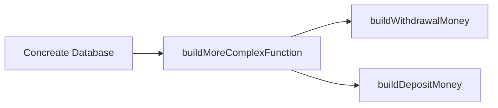
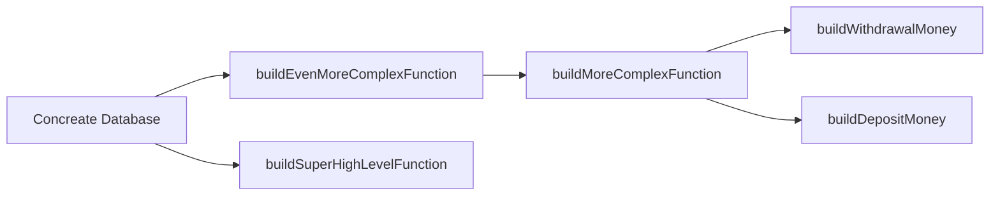

Dependency Injection is a powerful technique, that will move you to the next level of software development and design.

We assume you know:

- [Understand Software Architecture in 15 Minutes or Less
  ](Understand-Software-Architecture-in-15-Minutes-or-Less.md)

## The Problem

Imagine you are developing a bank. Your bank needs a `withdrawal` function, so people could get their money out. In the
nutshell:

- you need to load user's balance from a database to memory
- check that the user has enough money
- subtract withdrawal amount from the user's balance
- store the result in the database

A naive approach would look something like this:

```typescript
import * as database from './database'

export async function withdrawalMoney(email: string, amount: number) {
  const balance: number = await database.getUserBalance(email)
  const newBalance = balance - amount
  if (newBalance < 0.0) {
    throw 'Not enough money!'
  }
  await database.writeUserBalance(email, newBalance)
}
```

What is wrong with this solution?

### This Code Is Not Reusable

This approach makes your code less reusable. "How we store balance" is coupled with "
How we withdrawal money". We can not reuse "How we withdrawal money" in other places of our system, and we can't think
about them in separation.

if we need to make 2 parallel connections to 2 different banks, this architecture would not work. In fact, this code can
be used only once in one place with one database.

### This Code Is Hard To Test

It is hard to unit test `withdrawalMoney()`. And you need to test this function, or your customers can accidentally
withdrawal unlimited amount of money. To test this code you will need to run a Real Database, or you will need to mock
the whole './database' module with Jest. Any other function, that will use `withdrawalMoney()` deep inside, could not be
tested without a concrete implementation, or a module mock.

We want our code to be testable and reusable, and this solution holds us back. Luckily these problems have an easy
solution: dependency injection.

## Dependency Injection

Let's rewrite our function using dependency injection:

```typescript
type BalancePersistenceProvider = {
  getUserBalance: (email: string) => Promise<number>
  writeUserBalance: (email: string, newBalance: number) => Promise<void>
}

function buildWithdrawalMoney(database: BalancePersistenceProvider) {
  return async function withdrawalMoney(email: string, amount: number) {
    const balance: number = await database.getUserBalance(email)
    const newBalance = balance - amount
    if (newBalance < 0.0) {
      throw 'Not enough money!'
    }
    await database.writeUserBalance(email, newBalance)
  }
}
```

The code looks almost exactly the same, but there is lots of going on. The major change is:

- We can now build `withdrawalMoney()` function from the `BalancePersistenceProvider` protocol

`buildWithdrawalMoney()` function will construct `writeUserBalance()` from anything that
implements `BalancePersistenceProvider`. We can **inject** `BalancePersistenceProvider` into `writeUserBalance()`, hence
the name **Dependency Injection**. This is huge!

### DI Allows To Reuse Our Code

```typescript
const withdrwalFromBank1 = buildWithdrawalMoney(
  MSSQLdatabaseConnection('admin', 'pa$$word')
)
const withdrwalFromBank2 = buildWithdrawalMoney(
  PostgreSQLdatabaseConnection('aleksey', 'secret_pa$$word')
)
await Promise.all([withdrwalFromBank1, withdrwalFromBank2].map(
  f => f('test@email.com', 100))
)
```

### DI Allows Explicitly Mock Dependencies

```typescript
describe('withdrawalMoney', function () {
  function makeDatabaseMock(): BalancePersistenceProvider {
    return {
      getUserBalance: jest.fn().mockResolvedValue(100),
      writeUserBalance: jest.fn(),
    }
  }

  it('Should allow withdrawal money', async function () {
    const database = makeDatabaseMock()
    const withdrawal = buildWithdrawalMoney(database)

    await expect(withdrawal('test@email.com', 100)).resolves.toStrictEqual(
      undefined,
    )
    expect(database.getUserBalance).toBeCalledWith('test@email.com')
    expect(database.writeUserBalance).toBeCalledWith('test@email.com', 0)
  })

  it('Should not allow withdrawal more than you have', async function () {
    const database = makeDatabaseMock()
    const withdrawal = buildWithdrawalMoney(database)

    await expect(withdrawal('test@email.com', 200)).rejects.toMatch(
      'Not enough money',
    )
  })
})
```

Compare this with mock module approach:

```typescript
import * as database from './database'
import { withdrawalMoney } from './withdrawalMoney'

jest.mock('./database', (): typeof database => ({
  getUserBalance: jest.fn().mockResolvedValue(100),
  writeUserBalance: jest.fn(),
}))

describe('withdrawalMoney', function () {
  beforeEach(() => {
    jest.clearAllMocks()
  })

  it('Should not allow withdrawal money', async function () {
    await expect(withdrawalMoney('test@email.com', 100)).resolves.toStrictEqual(
      undefined,
    )
    expect(database.getUserBalance).toBeCalledWith('test@email.com')
    expect(database.writeUserBalance).toBeCalledWith('test@email.com', 0)
  })

  it('Should not allow withdrawal more than you have', async function () {
    await expect(withdrawalMoney('test@email.com', 200)).rejects.toMatch(
      'Not enough money',
    )
  })
})
```

Almost identical, however in the module mock case dependencies are implicit, they are hidden. This will add cognitive
load while working with this function:

```typescript
// This function has side effects, it also uses unknow dependencies.
// You will need jump to the definition and read its code, to know how to use it or test it
async function withdrawalMoney(email: string, amount: number): void {
  // ... this can be lots of complicated code, that we will need to understand and extract dependencies ...
}

// This function has no side effects, all its dependencies are explicit
// You can know how the function works and what effect it has only from its declaration
function buildWithdrawalMoney(database: BalancePersistenceProvider) {
  return async function withdrawalMoney(email: string, amount: number) {
    // ... implementation doesn't matter, we can allow ourselves not to look here ...
  }
}
```

Explicit dependencies scale better than implicit. Less cognitive load – easier to write your code.

Mocking modules also have limitations, for example "mock() is not allowed to reference any out-of-scope variables",
which is a hassle to work with. Refactoring becomes a bit clunky: if you move your module, you will need update your
mock()
calls; if dependencies have changed, you will need manually review your mocks, or can have dead code.

DI technique is extremely powerful, but there are drawbacks: you need pass dependencies; you need define protocols eg
types; and you need to work with functions that return other functions. These makes code more complex in the beginning,
but if your system is big (and your is) DI will save you from month of debugging and coding.

## Composition Root

As a developer, you will want build functions from other functions. When you use DI it looks like this:

```typescript
export function buildMoreComplexFunction(database: BalancePersistenceProvider) {
  const withdrawalMoney = buildWithdrawalMoney(database)
  const depositMoney = buildDepositMoney(database)
  return async function moreComplexfunction() {
    const email = 'test@email.com'
    await depositMoney(email, 100)
    await withdrawalMoney(email, 100)
  }
}
```

More complex DI functions could be constructed from other DI functions. During this process you need pass dependencies
throughout all functions. This forms a dependency tree, that looks like this:



The tree can grow and become deep and wide:



Passing dependencies is a hassle for sure, but allows you to construct business logic without concrete database
implementation. You could build a whole banking system, and test it from top to bottom, without any database code. This
also allows building systems in parallel: one developer builds database implementation, and another builds business
logic.

No matter how big is your tree, without a concrete implementation your application could not exist. You will need to
feed a concrete implementation in the root of the tree. This root is being called **composition root**. In the
composition root you compose your application and **inject** your dependencies into builders.

An application should have only one composition root. This will allow building and testing abstract functions without
concrete implementation. On the other hand a library may not have composition root, and still be very useful.

## Conclusion

In the nutshell: dependency injection allows you trade "write more code" to "write more reusable and testable code". In
the most cases it's a good trade. Write more code to write less code.

---
---

### :bulb: Help us to improve the Wiki
- Didn't find something?
- Explanations were not clear?

[Leave a feedback!](https://docs.google.com/forms/d/e/1FAIpQLScE_i7txZOlPgFhmnBOephz9hdhvnJDbXjmkKqnjRSjx_d8kg/viewform?usp=pp_url&entry.685765712=TypeScript-Dependency-Injection.md)

---

[What is your favorite hobby or a computer game?](https://forms.gle/X4U9Jni6s3hfSW8e6) Answer, and find out the 
answers of others! 

---

*Let's automate the world :earth_asia:*
