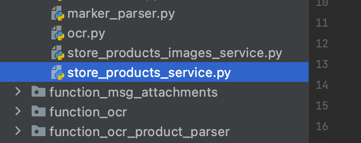
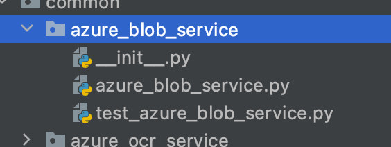

Assume we have such code, how to check, that is working correctly with an actual database?
Possible errors:
- typos
- database schema updated
- does this request allow to update data?

```python
    with pymssql.connect(server, user, password, dbname) as conn:
        conn.cursor().executemany(
            """
            INSERT INTO Ultimate (
                VendorId, 
                ItemNumber, 
                ImageUrl,
                Cost, 
                MstrRetailPrice,
                UpcNumber, 
                Bucket,
                Description,
                CasePack,
                Description2
            ) VALUES (%d, %s, %s, %d, %d, %s, %s, %s, %s, %s)
            """,
            [product for product in parsed_products if product]
        )
        conn.commit()
```

A naive approach would be manual testing. However, the thing is running in a cloud as a part of a huge system. You can't just run the system and check, that the thing is working correctly:
- deployment takes 20 mins
- then manual tests setup will take you another 10 mins

And if you manually validated, that the feature is working correctly, what happens, if you refactor the code? you will need one more manual validation, another 30 mins. This approach doesn't scale with system growth.

You need integration testing.

# Integration testing
The idea is simple:
- we isolate a part of a program we want to test in a small function
- and run this function against a read database. Not a production database tho, we can run it against a staging environment
- and the assert results
- if the results are correct - the function is working. If not, then CI/CD in GitLab will be red and a merge request to production will be not possible.

This is how it's done.

- locate the file with the function you want to test, it's called `store_products_service.py`



- you need to create a new file nearby that will hold the integration tests. The file name should start with `test`, eg `test_store_products_service.py`

- these two filed could be put in a separate folder like this.

This way they will be nicely isolated in a cozy folder and not pollute global space. Don't forget to put exports into `__initi__.py`. You can refer to `test_azure_blob_service.py` as an integration test example.

- a typical integration test looks like this:
```python
@pytest.mark.integtest
def test_azure_blob_service():
    test_service = azure_blob_service()

    assert test_service.get_blob_data('documents/example/test_data.pdf')[:4] == b'%PDF'
    assert test_service.get_blob_data(None) is None

```

`@pytest.mark.integtest` tells `pytest` that this test should only be run during integration testing. `assert` validates the test's results.

If you run `pytest -m integtest` in the terminal, you will execute all integration tests. You can run `pytest -k test_azure_blob_service` to run a specific test.

The test can look something like this:
```python
@pytest.mark.integtest
def test_store_products_service():
    # initialize test data
    products = [{...}, {...}]
 
    # call the function under tests
    store_products_service(products)

    # validate the results
    products_in_db = read_products_service(...)
    assert products_in_db == products
```
You also would like to tests the update scenario.

# Integraion tests need environment to function
`store_products_service` needs SQL_SERVER, SQL_USERNAME, SQL_PASSWORD, SQL_DATABASE environment variables to function. This kinda sucks, cuz you need to actually set the values in your environment. There is no way around it tho. You can't put an actual password in your code, it will be visible in git to every user and will be compromised, or accidentally used incorrectly. The environment variables are the easiest option to provide a password to a program without typing it in a code. 

Gitlab will provide environment variables while testing, but you need to configure your environment manually to run it locally.

Google, how to set environment variables for your os. Or you can run pytest like this `ENV_NAME='staging' ENV_NUMBER='5' pytest` this will work too on Mac or Linux.