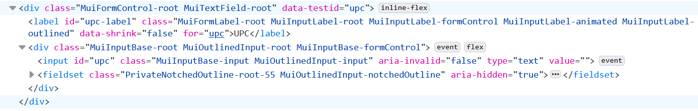
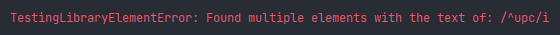

# CR5: Testing React Components Gotchas

### Intro
We use react-testing-library to write react unit tests, the tests work as expected, but there's a catch,
we want to test our ui components the same way the user interact with them, after all, our goal is for users to *use* or
*interact* with the user interface, which boils down to basically html elements

### The Problem: Overview
Sometimes we write tests that don't simulate the way users interact with our UI

### How users interact with the UI
As a user, say you have the following UI open in your browser


It's simple right? we can tell what ui component are there by looking at it for like 2 seconds, these are:
- Header with a title, and a logout button
- Upc TextField
- A table 

How do we do that?
1. eyes see the ui, input the visual image into the brain
2. the brain processes the input, like color, shape, orientation
3. we realise that we have a TextField with upc **label**, and we have to input an upc there

*you can read more about this [here](https://www.brainfacts.org/thinking-sensing-and-behaving/vision/2012/vision-processing-information) and [here](https://news.mit.edu/2014/in-the-blink-of-an-eye-0116) if you want to know the speed the brain has for processing visuals  (hint, it's fast)*
### The takeaway from how users interact with the UI
- Users identify TextFields as a rectangular form that has a space where we can write or read text, and it
might have a **label**
- In our case, our TextFields has labels most of the time, at least in the products page they do
- Most of the time, we (users) identify ui components by **text**, I might make the borders of a TextField empty,
but if I have a label there that says `upc:` chances are you'll think this is a TextField
  
Now let's take a look at our UPC TextField test in `products`:


We're expecting the component with `data-testid="upc"` to be defined, which works because we set `data-testid` to be the `id`
of the TextField.

The thing is, users don't know what `data-testid` is, and that's not they way they look or find html elements,
as a user my self, the way I would find the `upc` TextField is by either finding a rectangular shape where I can write
text in it, or by a label, in our case, the TextField has a label `upc`, and if we were to tell the users to 
"use the upc TextField to get the product's information", they'll expect some TextField labeled `upc`.

### React Testing Library Principles
1. Deal with DOM nodes rather than component instances
2. In general, utilities should encourage tests that use the components the way they're intended to be used
3. Utility implementations and APIs should be simple and flexible

*Read more [here](https://testing-library.com/docs/guiding-principles/)*

### The Problem: 
Testing whether a TextField is in our document using `data-testid` breaks the 2nd guiding principle of react-testing-library

### The Fix:
- Always prioritise queries in this order (that is, try to use the first one, if it doesn't work, try the next one and so on)
1. **getByRole**: query elements that are exposed in the [accessibility tree](https://developer.mozilla.org/en-US/docs/Glossary/Accessibility_tree)
2. **getByLabelText**: good for form fields, since users find elements using label text (this emulates a user behavior, and should be our top preference)
3. **getByPlaceholderText**: Placeholders can be [bad](https://www.nngroup.com/articles/form-design-placeholders/)
   and shouldn't be used as a substitution for labels, if placeholders are all that is left for us to use, then it's better than other alternatives
4. **getByText**: Outside of forms, text content is the main way users find elements. This method can be used to find non-interactive elements (like divs, spans, and paragraphs)
5. **getByDisplayValue**: The current value of a form element can be useful when navigating a page with filled-in values
6. **getByAltText**: `alt` attribute for elements that supports it (like `img`, `input`...)
7. **getByTitle**: The title attribute is not consistently read by screen-readers, and is not visible by default for sighted users
8. **getByTestId**: The user cannot see (or hear) these, so this is **only recommended for cases where we can't match by role or text or it doesn't make sense (e.g. the text is dynamic)**

### How to query TextFields
Query TextFields by their `label`, just like how users do, let's take a look at how the `upc`
TextField looks when rendered

JSX: 
```js 
<UITextInput
   id={'upc'}
   label={'UPC'}
   value={dataSource.variables.input?.upc ?? ''}
   onChange={({target: {value}}) => typeBarcode(value)}
/>
```
rendered html:

rendered html label:
```html
<label
  class="MuiFormLabel-root MuiInputLabel-root MuiInputLabel-formControl MuiInputLabel-animated MuiInputLabel-shrink MuiInputLabel-outlined MuiFormLabel-filled" 
  data-shrink="true" 
  for="upc" 
  id="upc-label">
  UPC
</label>
```
There are multiple ways we can use to query the TextField
- using: get by label text starting with "label value" (substring match, ignore case sensitivity)
  ```js 
  component.getByLabelText(/^upc/i)
  ```
  This will work if we have **only one TextField with that stating with that label**, if we have extra have more than one 
  TextField, say another one with the label `upc-extra`, it will fail:
  
  
- using: get by label text with "label value" (full string match ignore case sensitivity, **preferred**)
    ```js
    component.getByLabelText(/^upc$/i)
    ```
    works even if we have multiple TextFields starting with `upc`
    - an alternative to this without using regex: 
    ```js 
    component.getByLabelText('UPC')
    ```

### Conclusion
- UI tests should be written in a way that emulates the user's behaviour
  
- React Testing Library offers a variety of queries, we should follow them based on their priority


### :bulb: Help us to improve the Wiki
- Didn't find something?
- Explanations were not clear?


[Leave a feedback!](https://docs.google.com/forms/d/e/1FAIpQLScE_i7txZOlPgFhmnBOephz9hdhvnJDbXjmkKqnjRSjx_d8kg/viewform?usp=pp_url&entry.685765712=cr2-testing-parallel-code.md)

---

[What is your favorite hobby or a computer game?](https://forms.gle/X4U9Jni6s3hfSW8e6) Answer, and find out the
answers of others!

---

*Let's automate the world :earth_asia:*
